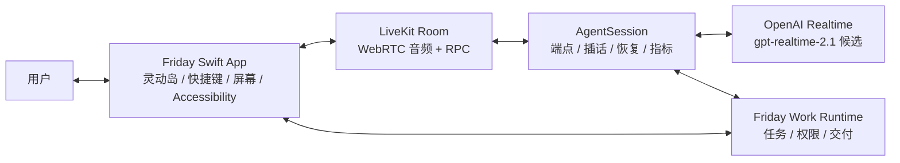

# Friday LiveKit Talk 技术验证计划

> 版本：0.1
>
> 日期：2026-08-03
>
> 状态：待执行，仅完成方案设计
>
> 关联：[GitHub Issue #6](https://github.com/jason2kkk/Friday/issues/6)

## 1. 结论先行

LiveKit 值得验证，但现在不应该替换 Friday 的 Talk。

它最可能解决的是实时语音会话编排：停说判断、自然插话、简短附和识别、误插话后的恢复、Provider 适配和逐轮指标。它不负责 Friday 已经建立的 macOS 输入目标锁定、屏幕框选、灵动岛、本地动作策略、后台 Work、Memory 或 Permission。

本次只定义如何验证，不接入 SDK、不创建云资源、不申请凭证、不发送音频，也不产生 OpenAI 或 LiveKit 费用。后续只有在产品负责人再次批准真实测试与预算后，才能进入技术验证实现。

```text
当前结论：候选 Conversation Runtime
不是：已选定的生产架构
```

## 2. 为什么需要这次验证

Friday 当前直接连接 OpenAI Realtime，并在 Swift 客户端自行管理：

- 麦克风采集、播放与 VoiceProcessingIO 回声消除。
- 本地近场声音门和播放期插话判定。
- Realtime 端点事件、450ms 续句窗口和回复创建。
- 误报声音丢弃、Assistant Item 截断和逐轮身份关联。
- Talk 状态、灵动岛反馈、图片上下文和工具调用。

这条路径可控，也已经积累了针对 macOS 的能力，但端点和插话仍需要大量产品调校。LiveKit Agents 把这些问题作为专门的语音 Session Runtime 处理，因此有机会减少 Friday 自研的会话编排复杂度。

引入它也会增加：

- 一个持续运行的服务端 Agent 进程。
- LiveKit Room、短期房间 Token 和服务端 API Key/Secret。
- Swift 客户端到 LiveKit、LiveKit Agent 到 OpenAI 的额外链路。
- LiveKit Cloud/Inference 与 OpenAI 两套可能独立计费的服务。
- 新的故障面、部署、观测、隐私和版本兼容责任。

所以问题不是“LiveKit 功能更多吗”，而是：

> 它能否在 Friday 的真实中文桌面场景里，稳定改善对话节奏，并且收益大于新增复杂度、延迟和费用。

## 3. 已核对的上游事实

本计划基于 2026-08-03 的源码检查：

- LiveKit Agents 最新稳定版为 [`livekit-agents@1.6.7`](https://github.com/livekit/agents/releases/tag/livekit-agents%401.6.7)。
- LiveKit Swift SDK 最新稳定版为 [`2.15.3`](https://github.com/livekit/client-sdk-swift/releases/tag/2.15.3)。
- `AgentSession` 支持统一管理 turn、interruption、false interruption recovery、工具和指标。
- 流式端点默认最短约 `0.3s`、最长约 `2.5s`；非流式默认约 `0.5s` 和 `3.0s`。这些只是框架默认值，不是 Friday 已验证的最佳值。
- Adaptive Interruption 最多分析约 3 秒重叠语音，默认约每 100ms 进行一次判断，远端推理超时默认为 700ms。
- 默认配置支持把误插话先暂停，并在约 2 秒的 false-interruption 窗口后恢复原回复。
- Adaptive Interruption 的默认推理端点是 LiveKit Cloud Agent Gateway，需要 LiveKit 侧授权；它不是一个完全本地、零服务依赖的分类器。
- `AgentSession.start(record=False)` 可以显式关闭 Session 录制。未显式设置时，录音、trace 和 log 的默认行为不能直接满足 Friday 的隐私边界。
- LiveKit OpenAI 插件的静态模型列表包含 `gpt-realtime-2`，没有列出 `gpt-realtime-2.1`；构造函数接受任意模型字符串，但这只能证明参数可传入，不能证明 2.1 的音频、推理、图片和工具事件全部兼容。
- LiveKit Swift SDK 可以自己管理麦克风、播放和音频处理；`.automatic` 会优先选择 Apple 平台 Voice Processing，不能使用时再回退到 WebRTC 软件处理，并能读取实际生效状态。
- Swift SDK 也支持手工输入 PCM，但手工渲染模式不会自动访问或播放音频设备，需要应用自己重新承担完整音频链路。
- Swift SDK 提供 RPC 和 Data Channel，可以在 Mac 客户端与 Agent 进程之间传递结构化状态或动作提议。

主要证据：

- [Agents turn 配置](https://github.com/livekit/agents/blob/livekit-agents%401.6.7/livekit-agents/livekit/agents/voice/turn.py)
- [Adaptive Interruption 实现](https://github.com/livekit/agents/blob/livekit-agents%401.6.7/livekit-agents/livekit/agents/inference/interruption.py)
- [AgentSession 录制选项](https://github.com/livekit/agents/blob/livekit-agents%401.6.7/livekit-agents/livekit/agents/voice/agent_session.py)
- [OpenAI Realtime 模型声明](https://github.com/livekit/agents/blob/livekit-agents%401.6.7/livekit-plugins/livekit-plugins-openai/livekit/plugins/openai/models.py)
- [Swift SDK 音频说明](https://github.com/livekit/client-sdk-swift/blob/2.15.3/Docs/audio.md)
- [Swift SDK RPC](https://github.com/livekit/client-sdk-swift/blob/2.15.3/Sources/LiveKit/Core/Room%2BRPC.swift)

## 4. 候选架构



### 4.1 所有权边界

| 能力 | 候选所有者 | 说明 |
| --- | --- | --- |
| 快捷键和灵动岛 | Friday Swift App | 启动立即显示，不等待 Room 或模型连接。 |
| 麦克风、播放、AEC | LiveKit Swift SDK | 技术验证时只允许一个物理音频所有者。 |
| Talk 端点和插话 | AgentSession | 验证 semantic endpoint、Adaptive Interruption 和误插话恢复。 |
| 模型连接 | 服务端 Agent | OpenAI 长期 Key 不进入 `.app`。 |
| 屏幕框选 | Friday Swift App | 仍由用户主动授权和本地 ScreenCaptureKit 完成。 |
| macOS 输入目标和动作 | Friday Swift App | AX 句柄不发送给 LiveKit 或模型。 |
| ActionProposal 传输 | LiveKit RPC | 只传结构化提议和回执，不直接操作 Mac。 |
| 后台 Work | Friday Work Runtime | 不让 AgentSession 取代持久化任务、权限和结果交付。 |
| Conversation/Memory | Friday Runtime | 不把 LiveKit 房间历史当成 Friday 的长期事实来源。 |

### 4.2 音频决策

第一轮验证采用 LiveKit Swift SDK 的设备音频和 `.automatic` 处理模式：

```text
LiveKit 模式启动
→ 不启动 Friday ConversationAudioService / VoiceProcessingIO
→ LiveKit AudioManager 独占麦克风与播放
→ 记录实际 AEC 为 platform 或 software
```

原因：

- AgentSession 必须接收 LiveKit Room 中的实时用户音轨。
- Swift SDK 已提供 Apple Voice Processing 与 WebRTC 软件处理的选择和状态回读。
- 若同时运行 Friday `VoiceProcessingIO` 和 LiveKit 设备音频，会出现双重采集、双重 AEC 或两个模块争夺音频设备。
- 手工 PCM 模式会让 Friday 继续承担播放、AEC、路由和转换，无法检验 LiveKit 完整语音链路的实际价值。

只有在 LiveKit 设备音频无法满足 Friday 的近场和回声体验时，才评估第二个“Friday 音频 + LiveKit 手工 PCM”实验；它不是默认方案。

### 4.3 产品边界

- Dictate 始终保留现有直接 `gpt-realtime-2.1` 路径。
- LiveKit 只可能成为 `ConversationProviding` 的另一个 Talk 实现。
- 用户界面不显示 Provider 或技术模式；实验仅通过 Debug 配置启用。
- 当前 Talk Provider 在验证期间保留，必须支持立即回退。
- 屏幕图片和本地动作不能直接暴露为 LiveKit 服务端的系统权限。
- AgentSession 工具只能提出结构化 ActionProposal；Mac 客户端继续执行本地策略、目标复验和 ActionReceipt。

## 5. 验证顺序

### Stage 0：零费用可行性

不使用真实凭证，只回答架构是否接得上：

1. 固定 LiveKit Agents `1.6.7` 与 Swift SDK `2.15.3`。
2. 用假 Room/Provider 验证 Session 状态可以映射到 Friday 的 listening、speaking、paused 和 failure。
3. 验证 `gpt-realtime-2.1` 的配置 payload 能通过插件本地构造，但明确不把构造成功写成模型兼容。
4. 验证短期 Room Token、RPC ActionProposal/ActionReceipt 和断线错误的类型契约。
5. 验证候选模式不会启动现有 `ConversationAudioService`。
6. 验证 `record=False` 为显式必填项，缺失时测试失败。

Stage 0 通过后，单独提交是否进入真实语音验证的决定；不自动进入下一阶段。

### Stage 1：受控真实语音对比

开始前必须再次获得产品负责人授权，并满足：

- 已有 LiveKit 测试项目和只用于服务端的 API Key/Secret。
- OpenAI Key 仍只保存在服务端。
- 设置 OpenAI 与 LiveKit 两侧可观察的预算或告警。
- 一次只运行一个 Talk Session，不做无人值守重试。
- 使用固定非敏感测试句，不读取真实邮件、文件或屏幕内容。
- `record=False`，并关闭对话正文、音频和截图的持久化。

对当前 Talk 和 LiveKit Talk 使用同一台 Mac、同一麦克风、同一扬声器、同一网络时段、同一模型与同一组脚本。网络明显变化时该批数据作废，不把它归因于框架。

### Stage 2：兼容性回归

只有 Stage 1 达到体验门槛后才执行：

- 选区图片能否在不主动回复的情况下附加，并只保留最近一张。
- RPC ActionProposal 是否仍由 Mac 本地策略复验，重复请求是否只执行一次。
- Talk 与后台 Work 是否继续互不阻塞。
- Room 或 Agent 断线是否保持明确失败并可回退到当前 Talk Provider。

Stage 2 仍不执行真实发送、提交、删除、购买或权限变更。

## 6. 真机测试矩阵

| 场景 | 固定方法 | 主要指标 | 通过门槛 |
| --- | --- | --- | --- |
| 中文停说 | 8 轮完整句，其中 3 轮含 300-600ms 句中停顿 | 提前截断、停说到首音频 | 至少 7/8 不提前截断且首音频不超过 2s |
| 环境噪声 | 回复播放时制造 10 次键盘、碰杯、椅子和远处声音 | 错误暂停、错误取消、新 Response | 10 次均不取消当前回复且不创建新回复 |
| 简短附和 | 回复中分别说“嗯”“对”“好”，共 10 次 | 是否错误视为抢话 | 至少 9/10 保持原回复继续播放 |
| 真实插话 | 回复中说“等一下”“不是这个”“停一下”，共 10 次 | 停止延迟、开头丢失、新意图响应 | 至少 9/10 在 800ms 内停播，且保留插话开头 |
| 误插话恢复 | 用咳嗽、短音节和不完整起声触发候选，共 10 次 | 是否恢复同一回复、恢复延迟 | 至少 9/10 不丢失原回复；若暂停，2.5s 内从原位置恢复 |
| 启动与回复延迟 | 冷启动 3 次、热启动 5 次、普通回复 8 轮 | 灵动岛首帧、可收音时间、首音频 P50/P90 | 灵动岛首帧不等待网络；候选链路首音频 P50 不比基线慢 250ms 以上，P90 不超过 2s |

补充观察：

- 10 分钟 Talk 的平均 CPU、内存和系统 Energy Impact。
- AEC 实际生效实现、音频设备切换和麦克风释放时机。
- Room、Agent、OpenAI 三段连接中具体失败的位置。
- 每轮 OpenAI 输入/输出 token 与 LiveKit 独立计费项。

自动音频或虚拟时钟测试只用于稳定复现状态机，不替代上述真机体验验收。

## 7. 诊断与数据边界

沿用 Friday 现有无内容 Turn 诊断，增加候选链路字段：

```text
session_id
turn_id
runtime = current | livekit
audio_processing = platform | software | unavailable
room_connect_ms
agent_ready_ms
speech_end_to_commit_ms
commit_to_first_audio_ms
interruption_decision_ms
false_interruption_resumed
openai_usage
livekit_usage_category
end_reason
```

禁止写入：

- 原始音频和完整转写。
- 用户或助手回复正文。
- 截图、Prompt、剪贴板或输入框内容。
- OpenAI Key、LiveKit API Secret、Room Token 和 Authorization header。

固定测试句只在人工验收表中按用例编号记录结果，不进入运行时普通日志。

## 8. 费用保护

本次文档工作费用为 `$0`。任何真实验证都需要单独批准。

建议 Stage 1 初始硬上限：

| 项目 | 上限 |
| --- | ---: |
| OpenAI Realtime | `$1.50` |
| LiveKit Cloud / Inference | `$0.50` |
| 首批总上限 | `$2.00` |

执行规则：

- 先核对当日官方价格和账户侧限制，再开始第一批。
- 每完成一个场景批次就核对两侧用量，不等全部跑完。
- 不自动重试，不并发跑多个 Session，不运行持续压力测试。
- 达到任一分类上限立即停止，不能用另一分类余额补齐。
- 需要订阅、最低消费、服务器或新增付费资源时另行确认，不包含在 `$2.00` 中。
- OpenAI 与 LiveKit 费用无法分开核对时，停止验证，不用估算值继续消耗。

## 9. 决策门槛

### 采纳

只有同时满足以下条件，才创建正式接入 Issue：

- 六项真机体验门槛全部通过。
- `gpt-realtime-2.1` 的音频、reasoning、图片和工具调用兼容性有真实证据。
- 候选链路没有破坏 Dictate、选区图片、本地 Action 和后台 Work 边界。
- 变量费用不高于当前链路 20%，或更高费用有明确且可感知的体验收益。
- 10 分钟会话的 CPU 与 Energy Impact 没有出现不可接受回归。
- 隐私、凭证、录制关闭、删除和故障恢复都有可审查实现。
- 当前 Talk Provider 可以保留到新链路完成真机验收，回滚不需要修改用户数据。

### 继续观察

满足主要体验门槛，但存在一个可隔离问题，例如 2.1 插件事件不完整、LiveKit 成本不可读或某种音频设备不稳定。记录证据并只为该问题建立后续 Spike，不开始整体迁移。

### 拒绝

出现任一情况即停止采用：

- 中文端点或真实插话没有稳定优于当前路径。
- 简短附和仍频繁打断回复，或误插话不能恢复。
- 首音频 P50 比基线增加超过 250ms，且没有明显体验补偿。
- 必须同时运行两套物理音频引擎才能工作。
- `gpt-realtime-2.1`、图片或工具调用无法可靠兼容。
- 无法关闭录制、无法核对费用，或需要把长期凭证放进 Mac App。
- LiveKit 迫使 Friday 放弃本地 Action、Permission 或 Work 的安全边界。

## 10. 最终产物

技术验证完成后应提交一份结果记录，包含：

1. 当前 Talk 与 LiveKit Talk 的同口径指标表。
2. 六类场景的成功数、失败数和无内容诊断证据。
3. OpenAI 与 LiveKit 分开统计的实际费用。
4. 音频处理实现、CPU、内存与 Energy Impact。
5. 已验证的 2.1、图片、RPC 和工具兼容边界。
6. `采纳 / 继续观察 / 拒绝` 结论和理由。
7. 若采纳，独立的生产接入 Issue、迁移顺序和回滚方案。

在结果记录出现前，Friday 的架构事实仍然是：Dictate 与 Talk 直接使用现有 Realtime Provider，LiveKit 只是候选方案。
