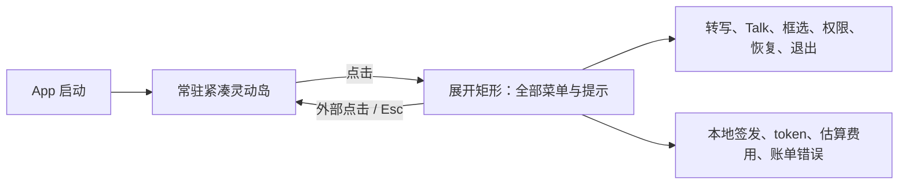

# Friday 交互架构

> 版本：0.4
>
> 日期：2026-08-03
> 状态：目标交互。除“当前状态”明确列出的内容外，不代表界面已经实现。

## 1. 核心判断

Friday 不应该把 Agent 架构直接暴露给用户。用户只需要理解三件事：

1. 我现在可以说话。
2. Friday 是否正在替我做一件事。
3. 某个动作是否需要我确认。

`Dictate`、`Talk` 和 `Work` 是内部能力边界，不应该变成启动前必须选择的复杂模式。现有两个快捷键继续承担高频入口：

- `Fn`：把口述整理后写回当前输入位置；必须单独按下并松开。
- `Control + Option`：开始或结束语音 Agent；当前由 Talk Runtime 承载，需要执行时再由 Friday 在后台创建任务。

Talk 内部改用 `ConversationRuntimeSession` 后，用户入口和视觉状态保持不变。Direct Realtime、候选 LiveKit 或未来其他 Transport 都只能在组合根/Debug 配置中选择，不能让用户先理解 Provider、Room、AEC 或录制策略才能开始对话。

## 2. 当前单入口层级



| 界面 | 负责 | 不负责 |
| --- | --- | --- |
| 紧凑灵动岛 | 常驻入口、Dictate/Talk 当前状态、声波和颜文字 | 接收按钮点击或遮挡其他 App |
| 展开矩形 | 全部菜单、权限提示、错误、结果、一次性通知、用量、刷新和退出 | 长期保存敏感内容或展示密钥 |
| 岛内确认状态 | 展示单个高风险动作的目标、影响和预览，并接收允许或拒绝 | 用模糊的一句语音授权不可逆操作 |

当前不创建菜单栏菜单和独立主窗口，也不显示屏幕底部 Toast。所有可操作提示都进入展开矩形；系统权限设置仍由用户点击岛内按钮后打开 macOS 系统设置。

## 3. 灵动岛状态

### Dictate

```text
开始录音
-> 实时声波
-> 整理状态
-> 成功写回后回到紧凑态
-> 失败或无输入目标时才展开结果恢复
```

Dictate 不进入任务中心，也不默认进入对话历史。它仍然是最快、最确定的输入工具。

### Talk

```text
启动 Talk
-> 颜文字 + 双向声波
-> 用户和 Friday 自然轮流说话
-> 需要工具时短暂确认“已创建任务”
-> Talk 立即继续，不等待后台任务完成
```

灵动岛只反映当前语音关系，不用“排队中、执行中、同步中”等工程状态替代颜文字和声波。

### 后台结果到达

- 用户正在说话：结果等待，不抢话。
- Friday 正在直接回答：结果等待当前播放结束。
- 用户空闲且结果很短：可以语音播报一次。
- 结果较长、需要核对或包含动作：只显示轻提示，并把完整内容放入任务详情。
- 用户打断结果播报：只停止本次播报，不取消已经完成的任务。

所有“未听到声音、任务已提交、权限不足、服务异常、处理失败”等反馈都展开同一矩形显示，不另建 Toast。短提示到时后自动回到紧凑态；需要恢复、复制或确认的内容保留到用户明确处理或收起。

## 4. 展开矩形

当前结构：

```text
Friday                          当前状态              [收起]
────────────────────────────────────────────────────────
[转写] [语音 Agent] [框选屏幕]

用量监控        Talk 回复 / token / 本次估算 / 本地会话
服务状态        余额不可读取或最近一次真实账单错误

权限、服务或恢复操作                               [处理]
最近一次结果                                 [复制] [清除]
────────────────────────────────────────────────────────
最近转写 token                              [刷新] [退出]
```

原则：

- 顶部与 macOS 刘海或菜单栏黑色区域连续，底部使用 28pt 圆角，视觉参考 `Doit_Mac` 的展开岛形变。
- 权限和服务正常时隐藏恢复行，异常时只显示用户可以执行的动作。
- 最近听写结果只在写回失败或用户需要恢复时出现，不长期占据菜单。
- token、估算费用和本地会话数是用户明确要求的开发期实时监控项；不展示 API Key、Authorization、Thread ID、revision 或内部错误堆栈。
- `sessions_issued` 只是本地成功签发计数，不代表剩余额度。
- 普通 Project API Key 无法读取 OpenAI 账户余额时明确显示“不可读取”；只有真实凭证请求返回账单错误后，才显示对应已知状态。
- 展开内容可以纵向滚动，固定窗口尺寸不能因错误文案、长结果或计数变化发生跳动。

## 5. 后续信息架构

当前阶段不实现独立主窗口。对话历史、后台任务和记忆形成真实 Store 后，再决定是在同一展开矩形中增加分页，还是引入独立工作区；在此之前不使用静态假数据搭建空壳页面。

若继续沿用单一灵动岛入口，信息密度按以下顺序扩展：

```text
[当前] [任务] [历史] [设置]
当前：快捷操作、权限、用量、最近结果
任务：公开状态、确认和结果
历史：经过校验的对话内容
设置：快捷键、隐私和数据删除
```

### 对话

- 默认进入稳定主 Thread，支持继续最近话题。
- 显示经过校验的用户原话和用户实际收到的助手内容。
- 没有 final ASR 的 Turn 显示“未保存原话”，不能用模型猜测补写。
- 新建话题和归档是显式操作，不在每次 Talk 前要求选择。

### 任务

- 使用清晰状态：等待、执行中、等待确认、正在取消、已完成、失败。
- 列表只显示标题、公开进度、更新时间和是否需要操作。
- 详情展示结果、已执行动作和回执；不展示模型内部推理。
- 用户可以继续对话，同时查询、取消或确认任务。

### 记忆

- 分为“待确认”和“已记住”，不显示数据库或检索术语。
- 每条记忆展示内容、来源和更新时间。
- 支持确认、修改和删除；删除后不再进入新回答上下文。
- 凭证、验证码和 Token 不允许进入这个界面。

### 设置

- 快捷键、权限、声音、隐私与数据删除。
- 当前开发期的实时用量已放在“当前”面板；未来设置页只负责价格版本、保留策略和是否展示诊断。

## 6. Agent 确认交互

可撤销本地文字写入不展示确认界面。用户明确说“把这些文字写入 Codex”后，Friday 直接执行一次；成功只说“写好了”，失败只说明一个可恢复原因，无法复验时请用户查看目标输入框。应用名解析或目标复验失败时不退回当前前台应用。

需要外部副作用的动作不能只用一句语音“好的”授权。灵动岛展开矩形切换到确认状态，至少展示：

```text
动作：发送邮件
目标：具体收件人
影响：将向外部发送内容
预览：主题和正文

[拒绝] [允许这一次]
```

- 确认只绑定当前 Work 和 Action。
- 用户可以收起确认状态后继续 Talk，任务保持“等待确认”；再次展开岛时仍能恢复该确认。
- 发送、删除、购买、提交和权限变更默认必须确认。
- 取消需要等待执行端回执，界面先显示“正在取消”。

## 7. 状态所有权

新架构下不能继续使用一个全局 `isWorking` 表示所有事情：

| 状态 | 生命周期 | 可否并行 |
| --- | --- | --- |
| Dictate | 一次录音到写回 | 与 Talk 互斥 |
| Talk | 一次由单一 Runtime 原子拥有的实时语音连接与音频链路 | 与后台 Work 并行 |
| Work | 从提交到终态，可跨 Talk | 可以排队或按策略并行 |
| Permission | 绑定具体 Action | 可以等待，不阻塞普通 Talk |
| Delivery | 结果到用户实际收到 | 等待用户空闲再交付 |

紧凑岛优先表达当前 Dictate/Talk 状态；展开快照可以同时表达“Talk 正在进行”和后台任务状态，后台任务不能覆盖麦克风或会话状态。

## 8. 当前状态与实施顺序

当前已经存在：

- 启动后常驻的 Dictate 与 Talk 紧凑灵动岛；
- 点击展开的统一矩形，包含所有快捷操作、权限恢复、提示、错误、最近结果、用量、刷新和退出；
- 外部点击、`Esc` 和按钮收起，收起后仍保留紧凑入口；
- 无输入目标时的结果恢复；
- Talk Presentation 已从 Coordinator 抽出接口；
- Talk Provider、音频端口和启停已收敛到 `ConversationRuntimeSession`；产品仍装配 Direct Realtime，界面行为不变；
- LiveKit 只存在无 SDK 的 Stage 0 契约，没有可见模式、真实 Room、真实语音或体验结论；
- 本地无外部副作用的 Mock Work Runtime、Talk 工具桥接和终态结果播报。
- 语音 Agent 的第一条可撤销本地 Action：用户可指定运行中的应用，Friday 复验其已聚焦输入框后写入一次；动作回执返回 Talk，对话连接保持。
- 用户停说到 Assistant 准备阶段直接显示静止的粉色声波，真实音频到达后只改变高度，不再先出现灰色等待声波。

当前尚未存在：

- 可恢复的 Conversation Store；
- Work 列表、任务详情和岛内高风险确认状态；
- Memory 管理界面；
- 跨重启的费用累计与可由普通 Project API Key 读取的账户余额接口。

实施顺序：

1. 真机验收常驻、点击展开、外部点击收起、所有提示归岛和多显示器行为。
2. 保持现有 `Fn` / `Control + Option` 入口不变；Runtime 装配边界已完成，继续完成 Conversation/Work Store。
3. Store 有真实数据后在展开岛内验证“对话”和“任务”分页，不使用静态假数据。
4. Work 能产生 ActionProposal 后实现岛内确认状态。
5. Memory Store 支持来源和删除后，再开放“记忆”页面。

候选 Talk Runtime 的真实对比不增加产品菜单。只有 Stage 1 真机证据达到采纳门槛后，才讨论迁移；在此之前不存在需要用户理解的“LiveKit 模式”。

## 9. 体验验收重点

- Talk 提交后台任务后 300ms 内恢复可对话状态，不持续显示任务进度。
- “写入 Codex”只写到已解析的 Codex 输入框；没有可靠目标时不写入别处，并保持 Talk 可继续。
- 可撤销写入不弹确认；成功口播只有“写好了”，`Command-Z` 可以恢复写入前内容。
- 用户停说后到 Friday 开始播放期间，声波颜色保持粉色，不经历灰色到粉色的跳变。
- 后台结果不能在用户说话时抢占音频。
- App 启动后紧凑岛常驻；紧凑态不阻挡其他 App 的指针操作。
- 点击紧凑岛展开，外部点击、`Esc` 和收起按钮恢复紧凑态，面板不出现文字截断或控件重叠。
- 单纯展开状态面板不启动麦克风、不创建 Realtime 凭证。
- 用户从任务或记忆页面返回当前应用时，原输入目标不会被错误复用。
- 所有可见文案使用产品语言；允许显示明确标注的 token 用量，但不出现 Provider ID、revision、密钥、Authorization 或内部错误堆栈。
