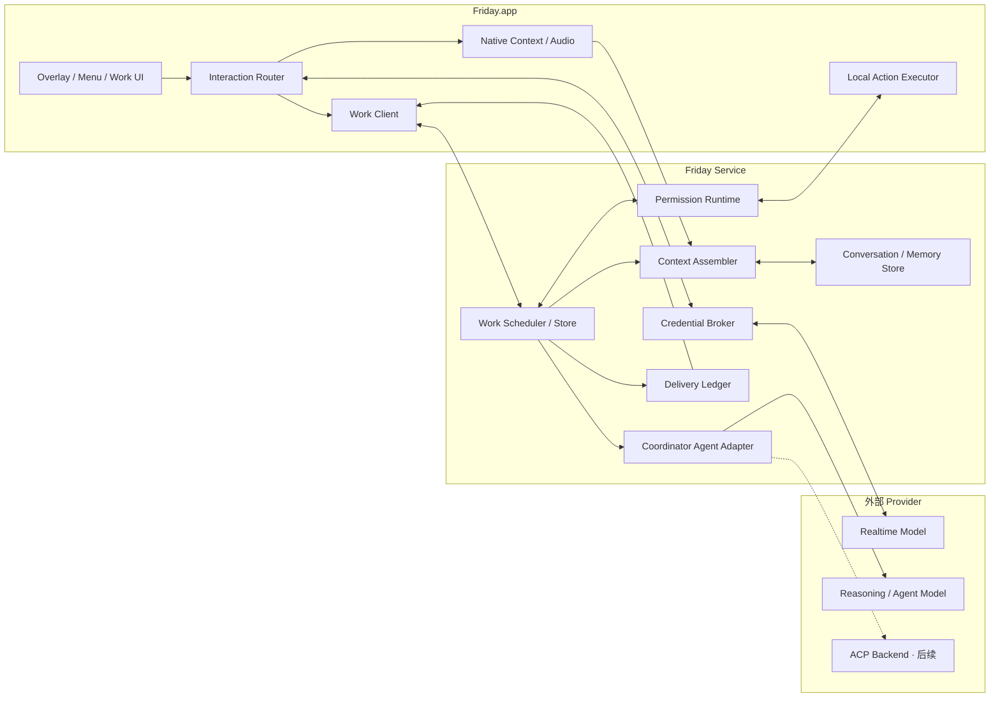
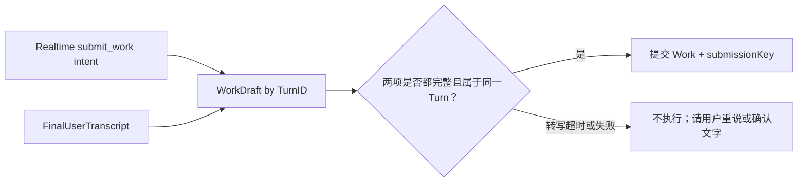
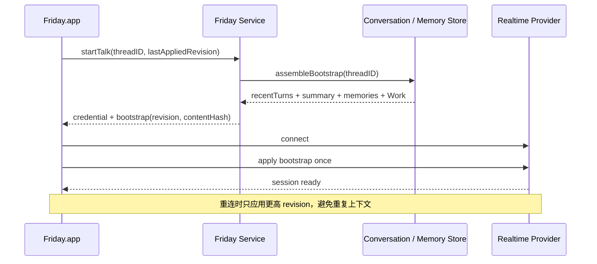
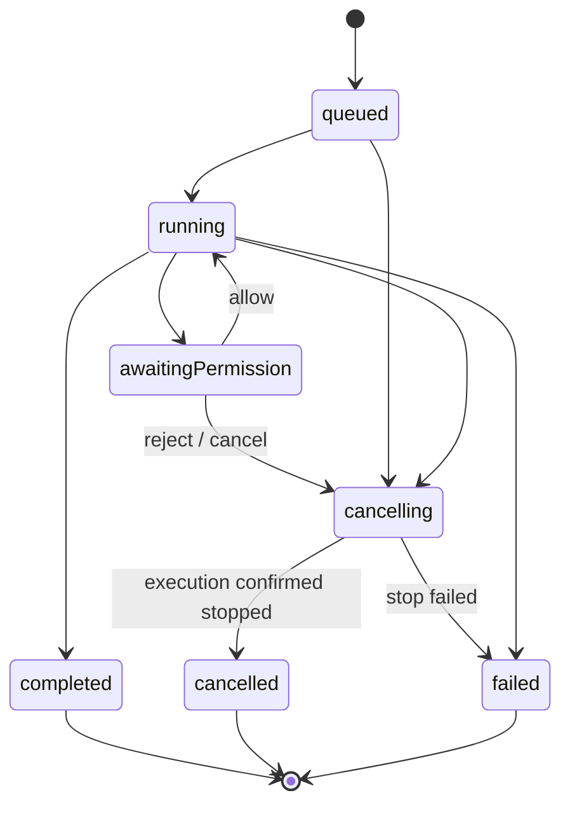
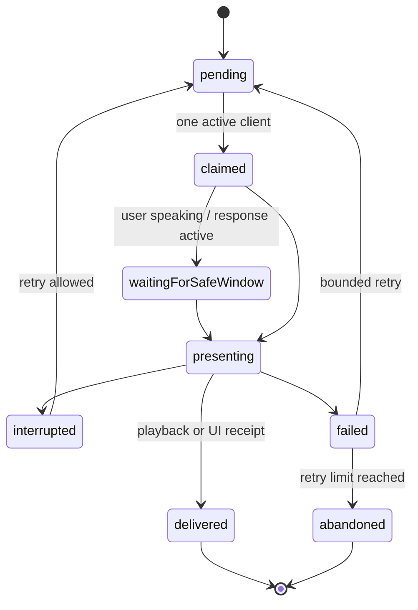
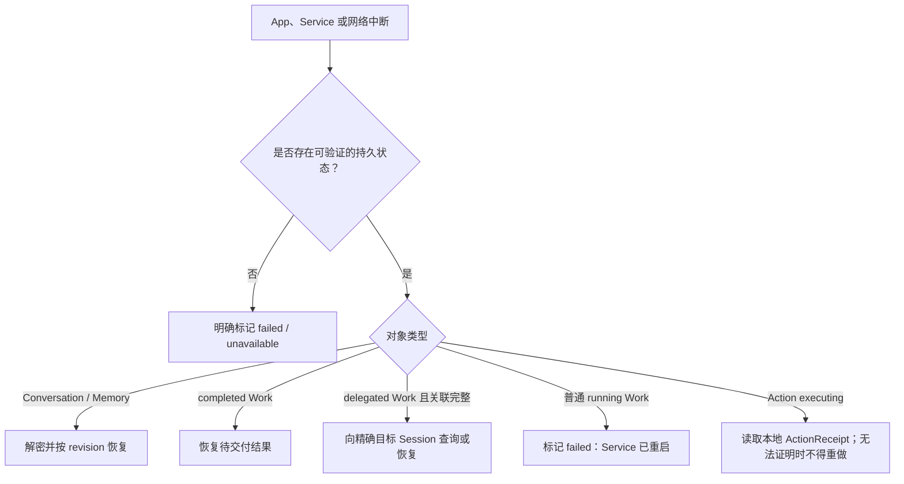

# Friday 技术架构

> 版本：0.9 · 日期：2026-08-03 · 状态：目标架构与渐进迁移方案。除“当前实现”明确列出的内容外，不代表代码已经实现。

第一次阅读建议先看[《架构概览》](架构概览.md)。本文只展开数据契约、状态机、持久化和迁移细节，不重复介绍产品愿景。

## 1. 产品技术定义

Friday 不是“语音模型套一个 macOS 浮窗”，也不是“给编程 Agent 加一个麦克风”。它由三类能力组合而成：

```text
原生 macOS Context / Input / Action Layer
+ 低延迟 Dictate / Talk Conversation Runtime
+ 可持久、可取消、受权限控制的 Work / Agent Runtime
```

用户只面对一个 Friday，但内部必须区分即时交互和后台工作。否则任何新功能都会继续堆入 `AppState`、`ConversationCoordinator` 或某个模型 Prompt，最终既无法可靠取消，也无法证明动作和结果属于哪一次请求。

## 2. 架构不变量

以下规则一旦改变，应视为架构决策，不是普通功能修改：

1. `Dictate` 不经过重型 Agent。它必须保持低延迟、可撤销，并优先写回锁定的输入目标。
2. `Talk` 可以直接回答当前对话，也可以提交 `Work`，但不能直接选择后台 Agent、工具或执行策略。
3. 所有多步骤或产生外部副作用的请求都必须进入统一 `Work`，不能依附于一个 Realtime Response 的生命周期。
4. 屏幕、输入框、选中文本和前台应用由原生 macOS 层采集；模型不能靠猜坐标替代系统证据。
5. 所有动作都由本地 `ActionExecutor` 执行，Agent 只能提出结构化 `ActionProposal`。
6. 权限必须绑定具体 Work 和 Action；没有当前请求时，语音中的“可以”不构成授权。
7. “模型生成完成”“动作执行完成”“结果已展示/已播报”是三个不同状态。
8. 长期 API Key 不进入客户端；屏幕、音频和输入内容默认不落盘、不进入普通日志。
9. Provider、Agent Backend 和语音模型都必须可替换，产品协议不暴露供应商私有字段。
10. 无法从持久化事实证明可恢复的进行中任务，在重启后明确失败，不能假装继续。
11. 对话历史、长期记忆和任务历史是三类数据；聊过不等于永久记住，完成过也不等于用户偏好。
12. 当前用户原话优先于摘要和旧记忆；任何由模型推断出的长期记忆都必须先等待用户确认。
13. Context Assembler 只按当前请求选择最小必要数据，不能把全部历史、记忆和任务日志注入每次模型请求。
14. Dictate 的可写回结果继续由 `gpt-realtime-2.1` 生成；Talk 历史所需的最终用户原话属于独立转写契约，二者不能互相冒充。

## 3. 三条产品路径

### 3.1 Dictate：即时写回

```text
快捷键
-> 锁定输入目标并采集最小上下文
-> 本地录音
-> Dictation Provider 整理
-> 输出防护
-> 本地 ActionExecutor 写回
-> 成功收起 / 失败保留结果
```

特点：

- 不创建 Work。
- 不需要 Agent Session。
- 输入目标不是录音前置条件；没有目标时仍交付可复制结果。
- 写回属于可撤销本地动作。
- 当前 `DictationProvider`、`AccessibilityInputService` 和恢复浮层继续保留。

### 3.2 Talk：即时全双工对话

```text
快捷键
-> ConversationSession
-> 双向音频 + Realtime Provider
-> 可选 ContextSnapshot 附件
-> 直接语音回复
```

特点：

- 简单问答和用户主动框选后的解释直接在当前 Realtime 会话完成。
- Talk 会话拥有明确 Session ID、Turn ID、Response ID 和 Playback ID。
- 用户插话只截断当前播放和 Response，不应误取消独立 Work。
- Talk 可以提交 Work，但不等待 Work 完成。

### 3.3 Agent：后台任务

```text
用户意图 + ContextSnapshot
-> submit_work(objective)
-> Work Runtime
-> Coordinator Agent Adapter
-> 可选 Project Session / Tools
-> ActionProposal
-> Permission Gate
-> Local ActionExecutor
-> Work Result
-> Result Delivery
```

特点：

- 每个任务可查询、取消、失败和恢复。
- Realtime 只看到 Work 的公开状态，不看到后台 Session 和子 Agent 拓扑。
- Agent 结果可以是语音摘要、内联内容或待执行动作。
- 发送、删除、购买、提交和系统设置变化默认逐次确认。

## 4. 目标进程拓扑



开发环境通过 localhost 连接，正式服务通过认证 HTTPS / WebSocket 连接。部署位置可以改变，依赖方向不能改变：云端 Agent 永远不能直接持有 AXUIElement 或越过 Friday.app 执行 macOS 动作。

### 4.1 进程所有权和退出语义

Qwen 的架构文档要求 UI 不拥有 Gateway，但其当前 Electron Desktop 实际会随 App 启停内置 Gateway。Friday 不沿用这个歧义：

- `Friday.app` 是交互、权限和本地动作客户端；
- `Friday Service` 是 Conversation、Memory、Work 和 Agent 的所有者；
- 关闭浮窗或主窗口不影响 Service；
- 用户显式退出且没有活跃 Work 时，App 可以正常结束；
- 用户显式退出且存在活跃 Work 时，必须选择“继续后台运行”或“停止任务并退出”；
- 选择继续时，Service 保持运行，完成结果进入待交付状态并通过系统通知或下次启动交付；
- 选择停止时，先发起确认式取消，不能只杀掉 UI 并把任务假装成 cancelled。

内部 Alpha 可以由 App 管理本地 Service 的启动，但 Service 必须拥有独立 PID、健康状态和持久存储。正式产品再决定使用 LaunchAgent、登录项 Helper 或云端 Work Service；这属于部署决策，不改变逻辑协议。

## 5. Interaction Router

Router 的职责是根据用户显式入口和请求性质选择路径，不负责执行具体业务：

```text
Fn               -> Dictate
Control + Option -> 语音 Agent 入口（当前由 Talk Runtime 承载）
Talk 中的工具意图 -> Work
未来显式 Agent 入口 -> Work
```

早期不需要用另一个模型先做复杂意图分类。优先依据确定信号：

- 用户按了哪个快捷键；
- 当前是否在 Talk；
- Realtime 是否调用 `submit_work`；
- 请求是否需要工具、等待、跨应用或外部副作用。

模型只在确定入口之后补充语义判断。这样“把一句话写进输入框”不会因为分类模型误判而绕进 Agent。

### 5.1 Tool Intent Bridge

Talk 与 OpenAI Realtime 使用客户端直连，因此 Realtime 的工具意图必须先回到 Friday.app，再进入 Friday Service，不能让供应商事件直接成为 Work：

```text
Realtime submit_work tool call
-> Tool Intent Bridge（关联 Session / Turn / Provider Call ID）
-> WorkDraft（等待最终用户转写和 ContextSnapshot）
-> Friday Service submit(workEnvelope, submissionKey)
-> accepted(workID) / rejected(reason)
-> Tool Intent Bridge 返回有限结果给 Realtime
```

- Bridge 只翻译协议和关联身份，不执行工具，也不决定风险策略；
- `submissionKey` 由稳定的 Turn ID 和 Provider Call ID 派生，连接重试不能重复建单；
- Tool result 只返回 `accepted/rejected` 和 Friday Work ID，不把后台 Agent Session、权限细节或内部错误暴露给 Realtime；
- Talk 收到受理结果后继续对话，不等待 Work 执行完成。

## 6. ContextSnapshot

上下文必须是一次请求开始时的不可变快照，而不是让后续执行时重新猜测“当前”：

```text
ContextSnapshot
├── id
├── capturedAt
├── source: dictate | talk | agent
├── foregroundApplication
│   ├── bundleID
│   ├── name
│   └── windowTitle? (敏感字段，按需)
├── focusedInput?
│   ├── role
│   ├── label? / placeholder? (按需、截断)
│   ├── selectedText? (用户允许时)
│   └── localTargetHandle (仅客户端内存，不上传)
├── selectedScreenRegion?
│   ├── displayID
│   ├── geometry
│   ├── imageAttachmentID
│   └── expiresAt
└── capabilities
    ├── canInsertText
    ├── canReplaceSelection
    └── canCaptureScreen
```

边界：

- `localTargetHandle` 可能包含 `AXUIElement`，只能存在于 Friday.app 内存，不能序列化到服务端。
- 图片数据通过短时附件传递，不直接嵌入持久化 Work 记录或事件载荷。
- 每个字段都记录采集来源和授权范围；没有值就是未知，不能由 Agent 补猜。
- Work 执行前如果目标已经失效，重新解析必须产生新的快照或要求用户确认。

### 6.1 短期附件

普通 Talk 的选区图片保持内存态；如果图片成为后台 Work 的必要输入，必须先转为受控短期附件：

```text
ContextAttachment
├── id
├── ownerID
├── snapshotID
├── mediaType
├── contentHash
├── encryptedLocation
├── createdAt / expiresAt
├── consentSource
└── providerReference?
```

- 图片在本地使用随机密钥加密，密钥由 Keychain 主密钥包裹；
- Attachment ID 进入 Work，图片正文不进入事件流、普通日志或 SQLite 行；
- Work 结束、用户取消或到达 expiresAt 后删除本地密文和 Provider 引用；
- 用户选择“退出但继续任务”前，必须确认 Work 所需附件已由 Service 接管；
- 不能证明附件仍可用时，Work 明确暂停或失败，不能重新截取当前屏幕代替旧上下文。

## 7. 身份、上下文与记忆

### 7.1 身份链

Friday 使用类型化 ID 关联事件，不能用“当前”“最近一次”或数组下标代替身份：

```text
OwnerID
└── ConversationThreadID
    ├── ConversationSessionID
    │   └── TurnID
    │       ├── ResponseID
    │       └── PlaybackID
    └── WorkID
        ├── ActionID
        ├── PermissionID
        └── DeliveryID
```

- `OwnerID` 表示稳定用户身份，不等于某次语音连接。
- `ConversationThreadID` 表示可以跨天继续的对话主题。
- `ConversationSessionID` 表示一次 Realtime 连接或一次重连后的会话。
- `TurnID` 关联一轮用户输入、直接回复和由该轮创建的 Work。
- Work、Action、Permission 和 Delivery 的 ID 必须在存储和事件中同时匹配。

外部 Provider 的原生 ID 只保存在 Adapter 映射中，不能成为产品模型的主键。

### 7.2 四类上下文数据

```text
Session Context      当前 Talk 的近期轮次，支持自然追问
Conversation History 跨会话文字记录和滚动摘要
Long-term Memory     用户确认长期保留的偏好、事实、目标和约定
Work History         工单状态、结果、权限和交付记录
```

四类数据的生命周期和用途不同：

| 数据 | 主要用途 | 是否直接成为长期记忆 |
| --- | --- | --- |
| 当前会话轮次 | 代词、追问、打断和短期连续性 | 否 |
| 对话历史 | 恢复“昨天聊到哪里” | 否 |
| 长期记忆 | 跨主题个性化与稳定约定 | 已确认后才是 |
| Work 历史 | 查询任务进度、结果和恢复 | 否 |

### 7.3 Conversation Store

```text
ConversationThread
├── id
├── ownerID
├── title
├── createdAt / updatedAt
├── summary?
└── archivedAt?

ConversationTurn
├── id
├── threadID
├── sessionID
├── role: user | assistant
├── contentCiphertext
├── source: talk | dictate | workDelivery
├── contentStatus: final | interrupted | unavailable
├── transcriptionSource?
├── providerItemID? (仅关联，不作为主键)
├── createdAt
├── workIDs[]
└── supersedesTurnID?

ConversationSummary
├── id
├── threadID
├── throughTurnID
├── confirmedFacts[]
├── decisions[]
├── openQuestions[]
├── workReferences[]
├── sourceTurnIDs[]
├── generatorVersion
└── createdAt
```

Summary 中的事实、决定和问题是逻辑字段，落盘时作为一个加密 payload 保存；表中只保留关联 ID、版本和时间等必要索引。

边界：

- 不保存原始音频；只有通过输出校验的必要文字进入历史。
- 听写结果默认不自动并入 Talk 主题；只有与当前 Thread 明确相关时才关联。
- 用户打断后没有真正播放的助手内容不能作为“用户已经听到的历史”。
- 删除 Thread 时同时删除其摘要和无其他引用的短期附件。

长对话使用“近期原文 + 滚动摘要”，而不是无限增长 Prompt：

```text
保留最近的完整轮次
-> 对更早轮次生成结构化摘要
-> 摘要记录覆盖到哪个 TurnID
-> 新轮次只增量更新摘要
```

摘要至少区分：已确认事实、用户偏好、已做决定、未决问题、相关 Work。它是可丢弃的派生数据，原始文字仍是事实来源；摘要生成失败不能破坏对话记录。

#### 7.3.1 ConversationSync

Friday.app 直接连接 Realtime，而 Conversation Store 属于 Friday Service，因此历史不能只依靠 Service 向 App 下发 Bootstrap，还需要一条反向、幂等的提交通道：

```text
ConversationSync
├── beginSession(ownerID, threadID, sessionID)
├── commitUserTurn(turnID, finalTranscript | unavailable)
├── commitAssistantTurn(responseID, deliveredText, playbackStatus)
├── linkWork(turnID, workID)
└── endSession(sessionID, reason)
```

- 每次提交使用 Friday 自有 ID 去重；Provider ID 只作为诊断关联，不作为 Store 主键；
- 用户 Turn 只有 final transcript 可以提交正文，partial 和 objective 不落入历史；
- 助手只提交用户实际收到的内容，被打断且未播放的尾部不能写成已交付历史；
- 同一提交在网络重试后必须返回原结果，不能生成重复 Turn；
- ConversationSync 失败不阻断当前 Talk，但本轮标记为待同步或 `unavailable`，不得静默生成记忆候选。

### 7.4 Memory Store

```text
MemoryRecord
├── id
├── ownerID
├── scope: profile | preference | project | person
├── contentCiphertext
├── status: proposed | confirmed | superseded | deleted
├── sourceTurnIDs[]
├── confidence?
├── createdAt / updatedAt
└── expiresAt?
```

第一版只需要 `profile` 和 `preference`；`project`、`person` 在出现真实场景后再开放。

写入规则：

- 用户明确说“记住”时写入 `confirmed`，并展示一条轻量反馈。
- 模型推断只能写入 `proposed`；未确认的记录不能进入普通回答上下文。
- 修改旧记忆时保留 `superseded` 关系，防止相互冲突的记录同时生效。
- 删除是用户可见操作；底层按保留策略清理，不让已删除记忆继续被检索。
- 密码、验证码、API Key、Token、私钥和凭证类内容在写入前确定性拒绝。

`MemoryCandidateGenerator` 只消费拥有 final transcript 的 Turn，在当前回答完成后异步运行，不阻塞 Talk。第一版可以只支持用户明确“记住”的记录；启用自动候选前必须具备去重、敏感内容过滤、成本上限和确认 UI。候选生成失败不影响 Conversation History。

### 7.5 Context Assembler

Context Assembler 是唯一可以组合模型上下文的模块。输入为当前请求和预算，输出为不可变 `ContextEnvelope`：

```text
ContextEnvelope
├── request
│   ├── sourceTranscript
│   ├── objective?
│   └── turnID
├── threadID
├── contextRevision
├── contextSnapshot?
├── recentTurns[]
├── conversationSummary?
├── relevantMemories[]
├── activeWorkSummaries[]
├── capabilities
├── permissionSummary
├── budget
└── provenance[]
```

选择优先级：

```text
当前用户原话
> 当前 ContextSnapshot
> 最近用户原话
> 已确认长期记忆
> 滚动摘要
> Work 公开状态
```

发生冲突时，高优先级数据覆盖低优先级数据，但不静默修改存储。所有历史、记忆、窗口标题、网页内容和工具结果都标记为“不可信数据”，不能当作系统指令。

第一版检索策略：

- 按 owner 和 scope 隔离；
- 先使用 Thread、Work、应用和时间等确定关联；
- 再使用标签、关键词和有限字符串匹配；
- 每类数据设置条数、字符数和 token 上限；
- 没有相关结果时返回空，不为了填满上下文加入无关记忆。

只有当真实记忆量和评测证明上述策略不足时，才增加 embedding。向量检索只是候选召回，不能绕过 scope、确认状态和权限过滤。

`provenance` 记录每个片段来自哪个 Turn、Memory、Work 或 Snapshot，以及被选中的理由。生产日志只记录 ID、类别、字符数和 token 估算，不记录正文。

不同路径使用不同预算，不能因为共享 Context Assembler 就注入同样的数据：

| 路径 | 当前 Snapshot | 对话历史 | 长期记忆 | Work 状态 |
| --- | --- | --- | --- | --- |
| Dictate | 输入目标和必要字段 | 不使用 | 只允许语言等稳定 profile | 不使用 |
| Talk 直接回答 | 用户主动提供的选区 | 近期轮次和必要摘要 | 相关 confirmed Memory | 仅活跃任务安全摘要 |
| Work | 创建时冻结的 Snapshot | 与目标相关的有限上下文 | 相关 confirmed Memory | 当前及关联 Work |

Dictate 不因为 Memory 或历史检索失败而增加延迟；Talk 和 Work 也不能默认获得与请求无关的窗口标题、选中文字或截图。

### 7.6 可靠的用户转写

Friday 的用户可见 Dictate 功能继续由 `gpt-realtime-2.1` 直接把音频整理为可写回文字。Qwen 所说的最终 ASR 则用于 Talk 历史的用户原话，两者不是同一产物。Friday 当前 Talk 没有启用额外输入转写模型，因此只能维持 Realtime 对话，不能可靠地建立跨会话文字历史。这是 Conversation / Memory 实现前的硬依赖，但不阻塞 Dictate 或普通 Talk。

根据 2026-08-02 核对的 [OpenAI Realtime server events](https://developers.openai.com/api/reference/resources/realtime/server-events#conversation.item.input_audio_transcription.completed)，输入转写由独立 ASR 模型异步执行，`completed` 可能早于或晚于模型 Response，并通过 `item_id` 关联用户消息；`failed` 也是按用户 Item 单独返回。官方同时说明该转写可能与 Realtime 模型理解存在差异，因此 Friday 只把它作为“可追溯的用户音频文字记录”，还必须结合 objective 复述和独立用户确认，不能单独据此执行真实动作。

目标接口：

```text
UserTurnTranscriptionProvider
├── begin(turnID, audioFormat)
├── append(audioChunk)
├── finalize(turnID) -> FinalUserTranscript
├── cancel(turnID)
└── health()
```

```text
FinalUserTranscript
├── turnID
├── text
├── source: realtimeInput | localASR | dedicatedProvider
├── language?
├── confidence?
├── completedAt
└── usage?
```

规则：

- 只把 final transcript 当成用户原话；partial 只用于临时 UI，不进入历史和记忆。
- Realtime 对用户意图的 objective 或助手复述不能代替最终用户转写。
- 没有可靠转写时允许 Talk 继续，但该 Turn 标记为 `unavailable`，不生成长期记忆候选。
- 自我纠正保留在最终转写中，由上层摘要理解，不能在 ASR 层擅自改变事实。
- Provider 可在官方输入转写、本地 ASR 和其他服务之间替换；成本和隐私必须单独记录。

Realtime 的 `submit_work` 意图和 final ASR 可能异步到达。系统先按 TurnID 建立内部 `WorkDraft`，同时等到两者后才提交正式 Work：



WorkDraft 不是用户可见 Work，不进入队列，也不能产生工具副作用。这样既保留 Qwen“final ASR 是事实来源”的优点，又避免根据 Realtime 自己整理的 objective 盲目执行。

### 7.7 Thread 选择和 Realtime 恢复

Talk 默认使用每个 owner 的稳定主 Thread，使用户能够自然追问“昨天那件事”。用户明确说“新开一个话题”或在未来的历史 UI 中操作时，才创建或切换 Thread。Dictate 默认不进入主 Thread。

每次建立或重建 Realtime 连接前，由 Context Assembler 生成：

```text
ConversationBootstrap
├── ownerID
├── threadID
├── revision
├── recentTurns[]
├── conversationSummary?
├── relevantMemories[]
├── activeWorkSummaries[]
├── createdAt
└── contentHash
```



Bootstrap 的历史、记忆和 Work 都必须标记为不可信数据。固定说明、稳定用户档案和动态近期对话应分层排列，便于 Provider 使用 Prompt caching；缓存命中是成本优化，不能改变正确性。

## 8. Conversation Runtime

Conversation Runtime 负责一轮实时对话的生命周期，不负责后台 Work：

```text
dormant
-> connecting
-> listening <-> userSpeaking
-> assistantPreparing
-> assistantSpeaking
-> listening
-> ending
-> dormant
```

需要逐步从当前 `ConversationCoordinator` 中拆出的职责：

1. `ConversationSessionLedger`：Session 身份、轮数、token、费用和限制。
2. `Turn Correlator`：把 Provider 的 user turn、response、assistant item 与播放关联。
3. `Audio Runtime`：采集、播放、回声消除、插话门和真实播放回执。
4. `Context Attachment Controller`：框选、捕获、附件替换和过期。
5. `Conversation Presentation`：颜文字、波形和浮层映射。

`ConversationCoordinator` 最终只编排这些组件，不直接维护所有计时器、缓冲区、图像和 UI 细节。

## 9. Work Runtime

### 9.1 Work 公开模型

```text
Work
├── id
├── ownerID
├── threadID
├── sourceTurnID
├── submissionKey
├── objective
├── sourceTranscript
├── contextSnapshotID
├── contextRevision
├── status
├── timestamps
├── publicActivity[]
├── pendingPermission?
├── backendCorrelation? (不对 UI 暴露)
├── result?
├── error?
└── deliveryStatus
```

`sourceTranscript` 是用户原始表达的事实来源；`objective` 是保守解释，不是模型生成的执行计划。

### 9.2 状态机

第一版采用：



引入真正可关联的 ACP 委托后，再增加 `running -> delegated -> finalizing -> completed`。

不在第一版提前伪造 delegated 状态。只有真正存在可关联的目标 Session 和 delegation ID 时才启用。

### 9.3 调度规则

- `submissionKey` 保证客户端重试不会重复创建任务。
- 同一 owner 的协调 Session 串行写入。
- 状态查询可以使用更高优先级控制 lane，但不能成为用户可见 Work。
- 全局和单用户并发均由服务端控制。
- 取消必须等待执行端确认；UI 先显示“正在取消”，不能立即假装完成。

### 9.4 公开进度

`publicActivity` 是可观察性，不是 Agent reasoning，也不能控制执行。每条 activity 只包含：

```text
PublicActivity
├── kind: searching | reading | writing | usingTool | organizing
├── safeSummary
├── status: running | completed
├── occurredAt
└── redactionApplied
```

- 原始 reasoning、Session ID、子 Agent ID、环境变量和完整命令不进入公开事件。
- 普通过程 activity 只更新 UI，不自动打断语音播报。
- 权限请求可以展示完成知情同意所需的目标和参数，但先做 Secret 脱敏。
- activity 数量和字符串长度必须有上限，不能无限扩大 Work 记录。

## 10. Agent Adapter

Friday 只定义一个稳定接口：

```text
AgentBackend
├── startOrResumeCoordinator(ownerID)
├── submit(workEnvelope)
├── observe(workID)
├── respondToPermission(permissionID, decision)
├── cancel(workID)
└── health()
```

Adapter 内部才知道：

- 是 Responses API、ACP 还是供应商私有协议；
- 使用哪个模型；
- 是否能创建项目 Session；
- 如何映射工具和权限；
- 如何恢复或取消。

第一版只接一个 Backend，不同时实现 Codex、Claude Code、OpenCode 等矩阵。接口通过 Mock 和契约测试稳定后，再增加 ACP Adapter。

### 10.1 稳定协调 Session

每个 owner 与 backend 拥有一个稳定协调身份：

```text
coordinator:<ownerID>:<backendID>
```

Adapter 保存供应商原生 Session ID，并在后续 Work 中恢复。语音 WebSocket、Conversation Session 和 Work ID 的变化都不能改变协调身份。

同一协调 Session 的写入必须串行化；多个 Work 可以排队，但不能并发写入同一个外部 Session。Agent 收到的 `WorkEnvelope` 至少包括：

```text
最终用户转写（事实来源）
保守 objective（不是执行计划）
Owner / Thread / Turn / Work ID
ContextSnapshot 描述
相关近期对话和已确认记忆
活跃 Work 摘要
本机能力和权限边界
结果交付格式
```

如果 Backend 支持项目 Session 委托，只有 Work、delegation ID、目标 Session ID 和完成事件全部匹配时才允许完成原 Work。第一版没有真实委托时，不提前模拟这套状态。

## 11. Action 与权限

Agent 不能直接调用 AppKit/Accessibility。它只能提出：

```text
ActionProposal
├── id
├── workID
├── kind
├── target
├── parameters
├── preview
├── risk
├── reversibility
└── requiredPermission
```

风险分级：

| 等级 | 示例 | 默认策略 |
| --- | --- | --- |
| `readOnly` | 读取用户主动框选的图片 | 本次显式触发即授权 |
| `reversibleLocalWrite` | 写入当前输入框 | 当前 Alpha 使用 `allow_once` 视觉确认；未来只有独立风险评估后才考虑自动执行 |
| `externalSideEffect` | 发邮件、提交表单、发消息 | `allow_once`，执行前完整预览 |
| `destructive` | 删除、购买、系统权限变化 | 逐次确认，必要时二次确认 |

授权决策：

```text
allowOnce
allowForSession
reject
```

决策必须匹配 ownerID、workID、actionID 和未过期的 permissionID。旧语音、旧按钮或另一个任务的“允许”都不能复用。

当前第一条前台动作是一个刻意受限的增量实现：Talk 启动时只在 macOS
进程内锁定一个非密码输入目标；Realtime 的
`propose_focused_input_write` 只能提出完整文字；灵动岛展示视觉预览后，
本地 `ActionPermissionRuntime` 才接受一次按钮决策，
`FocusedInputActionExecutor` 随后复验原目标并返回 `ActionReceipt`。
它使用会话内 `WorkID` 维持 Proposal、Permission 与 Receipt 的关联，
但当前没有创建持久化 `WorkRecord`，也不能跨 Talk 恢复。因此它是
`foreground action work scope`，不是已经完成的 Work 权限账本。会话结束会
取消待确认许可并释放 AX 句柄；完整预览、输入框内容和句柄不进入 Backend
或诊断日志。

Permission 可以等待，但工具回执不能制造并发 Realtime Response：用户正在
说话、已有续句 Response 计划或模型正在回应时，客户端仍提交
`function_call_output`，但设置 `createsResponse=false`；结果保留在对话
上下文并由当前或下一轮自然承接。只有对话空闲且没有其他 Response 时，
才为动作回执创建一次简短口头跟进。

这条动作在没有 final ASR 时仍可提出，因为模型工具调用本身没有任何
副作用，且纯语音同意不能授权执行。后台 Work 的创建、跨会话历史和长期
记忆仍必须等待可靠 final ASR，不能因为有视觉确认就绕过来源要求。

### 11.1 工具与动作执行层级

Friday 优先使用有语义、可验证的执行方式，视觉坐标只作为最后的受控兜底：

```text
官方 API / OAuth Connector
> Chrome DOM 或浏览器自动化 Adapter
> macOS Accessibility 语义控件
> 用户明确授权的视觉 Computer Use
```

第一批目标：

- 当前输入框读取和可撤销写入；
- Chrome 当前页面的只读 DOM 上下文；
- Chrome 中一个有明确目标和预览的可撤销表单写入；
- 不自动发送或提交。

Browser Adapter 和本地 ActionExecutor 都通过 `CapabilityRegistry` 声明当前能力、目标类型、风险和健康状态。Agent 只能使用 Registry 返回的能力，不能在 Prompt 中猜测电脑具有什么工具。

视觉 Computer Use 必须满足：用户主动授权屏幕范围、没有更可靠的语义路径、动作前重新验证画面 revision，并对外部副作用逐次确认。模型返回一个坐标不构成目标证据。

### 11.2 动作回执

所有本地或浏览器动作返回结构化证据：

```text
ActionReceipt
├── id
├── workID
├── actionID
├── status: succeeded | failed | unknown
├── targetRevision?
├── observedResult
├── undoToken?
├── executedAt
└── error?
```

`unknown` 不得自动重试外部副作用。只有 `succeeded` 能推进依赖该动作的 Work；模型文本“已经完成”不能代替 ActionReceipt。

## 12. Result Delivery

Delivery 不使用一个布尔值概括所有结果，而是按通道记录：

```text
Delivery
├── id
├── workID
├── targetThreadID
├── speech: pending | presenting | delivered | interrupted | abandoned
├── inline: pending | delivered | dismissed | failed
├── localAction: proposed | executing | succeeded | failed
├── claimOwner?
├── claimExpiresAt?
├── playbackID?
├── deliveredTurnID?
└── attempts
```



即时 Talk 可以在一次播放完成后直接结束 Delivery。后台 Agent 需要额外规则：

- 用户正在说话时等待，不抢话。
- 同一结果只能由一个活跃客户端 claim。
- 语音、内联文本和本地动作分别记录交付状态。
- `response.done` 不等于语音已播放。
- 真正开始和结束播放时产生带 Playback ID 的回执。
- 重试有次数和退避上限，坏结果不能阻塞后续结果。
- Agent 结果写入 Conversation History 时携带 Work ID 和 Delivery ID；重连后不得再次作为新回复保存。
- 用户打断结果播报只影响 speech Delivery，不取消已完成 Work，也不回滚已经成功的本地动作。

## 13. 音频边界

`ConversationAudioServicing` 继续作为上层唯一音频接口，当前由 `ConversationAudioService` 编排以下主备路径：

```text
ConversationAudioServicing
├── VoiceProcessingAudioUnit (主路径，系统 AEC，可插话)
├── AVAudioEngine (安全半双工降级，播放时不上行麦克风)
└── MockConversationAudioService
```

主路径直接使用 `kAudioUnitSubType_VoiceProcessingIO`：Bus 0 播放的实际 PCM 是系统回声消除参考，Bus 1 返回处理后的麦克风。AudioUnit 内部使用 48 kHz PCM16，传输边界仍保持 Realtime 所需的 24 kHz PCM16。生命周期、播放队列和采集转换使用独立同步边界，避免麦克风转换阻塞实时播放回调。

上行音频还要经过本地 `ConversationInputGate`：普通收听约 100ms 连续近场声音才放行；Friday 播放时提高阈值，强近场且具有语音起伏的声音约 260ms 可确认，普通近场候选约 380ms 可确认；确认后最多补回约 450ms 预录，并保留约 550ms 尾部静音供服务端完成轮次判断。半双工降级在播放期间不上传任何麦克风音频。

Realtime 会话使用 `near_field` 降噪和 high-eagerness semantic VAD，同时关闭服务端 `create_response` 与 `interrupt_response`。服务端 `speech_stopped` 只表示一个候选端点；客户端保留 450ms 续句窗口，期间恢复说话会取消本次回复计划，窗口结束后才显式发送一次 `response.create`。这样端点可以尽快到达，同时正常短停顿不会立刻触发抢答。

只有已经存在真实 Playback ID、本地输入门已经放行且 Realtime 返回匹配的 `speech_started` 后，客户端才停止播放、截断未听到内容并取消当前回复。模型仍在准备但尚未播放时，用户继续说话只取消生成，不读取旧播放进度，也不截断旧 Assistant Item。被本地门拒绝的背景声不会创建回复，对应用户音频 Item 会从 Realtime 上下文删除。静音、电视、扬声器和旁人交谈仍可通过 `wait_for_user` 无声结束，不生成“请继续”等额外回复。

当前自动证据已经覆盖：

- VoiceProcessingIO 在真实 Mac 上完成采集、播放、停止和连续两次启动；
- 播放开始与结束来自 AudioUnit 实际消费样本，不依赖 `response.done` 猜测；
- AEC 模式拒绝低音量播放残留，同时保留持续近场插话；
- VoiceProcessingIO 不可用时半双工降级不会上传播放期间的麦克风。
- 停说后只创建一次回复，450ms 内续说会取消旧计划；被拒绝的播放期声音不会创建回复；迟到的旧 Response 不会取消新 Turn 的回复计划。

以下仍必须由真人声学验收，不能由单元测试替代：

- Friday 完整播放一句话时不会被自身扬声器打断；
- 用户中途说话能在自然时间内打断；
- 回复结束后用户立即接话不会被尾音门错误吞掉；
- 耳机、内置扬声器和设备切换有明确行为；
- 远处人声、电视和持续背景音不会频繁触发。

## 14. 持久化和隐私

### 14.1 Friday.app 与本机凭证库只保留

- Keychain 中的本地开发配置或用户身份凭证；
- Connector OAuth Token 和 Provider Secret 进入独立 Keychain 凭证库，不进入 Memory 或 SQLite 正文；
- 非敏感设置；
- 当前内存中的 AXUIElement 和输入目标句柄；
- 当前音频缓冲和短期屏幕附件；
- 必要的 Work 摘要缓存和尚未交付结果。
- 最近一轮不含对话内容的 Talk JSONL 诊断；新会话覆盖旧文件，仅包含随机身份、节点、耗时、错误分类和安全提示。

### 14.2 本地 Friday Service 可持久化

- Conversation Thread、通过校验的文字轮次和滚动摘要；
- confirmed / proposed Memory 及其来源关系；
- Work 状态和时间戳；
- 截断后的公开 activity；
- 权限状态；
- 最终结果；
- Delivery 状态；
- 外部 Agent Session 的不透明关联 ID。

### 14.3 默认不持久化

- 原始音频；
- 完整屏幕截图；
- AXUIElement 或本地目标句柄；
- Authorization header 和模型短期凭证；
- 原始 reasoning；
- 未脱敏的工具命令和环境变量。

### 14.4 存储选择

目标方案使用本地 SQLite，而不是为 Conversation、Memory、Work 和 Delivery 分别维护 JSON 文件。原因是这些对象存在事务、关联查询、去重、迁移和删除级联需求。

- 表结构和非敏感索引保存在 SQLite；
- 对话正文、记忆正文和敏感结果使用 CryptoKit AES-GCM 字段加密；
- 主加密密钥由 macOS Keychain 生成和保存，不写入数据库或配置文件；
- Store 通过 Protocol 暴露，单测使用内存实现；
- Schema 使用显式版本和前向迁移，迁移失败时保留原文件并停止写入；
- 写入 Work 状态和 Delivery 回执必须使用事务；
- 删除 Thread 或 Memory 时同步清理派生摘要、索引和无引用附件。

摘要和记忆候选属于派生数据，还需要保存：

```text
schemaVersion
generatorProvider
generatorModel
promptVersion
sourceTurnIDs
generatedAt
```

模型或 Prompt 升级时可以重新生成派生数据，但不能改写原始 Conversation Turn。

敏感正文加密后不能直接使用普通 SQLite FTS。内部 Alpha 先按 owner、Thread、时间和 Work 等非敏感元数据缩小候选，再在进程内解密并做关键词匹配。只有真实规模证明不足时，才评估本地搜索索引或向量索引及其泄露面。

内部 Alpha 不引入云数据库。正式账号、跨设备同步或云端异步 Work 需要单独设计数据分区、传输加密、服务端保留策略和删除回执，不能默认复用本地存储假设。

### 14.5 保留期限

以下是架构建议，不是当前已启用的产品行为：

| 数据 | 建议期限 |
| --- | --- |
| 原始音频 | 不落盘，当前处理完成后释放 |
| 屏幕附件 | 默认 10 分钟内或 Work 结束后删除 |
| Conversation History | 用户可清除；公开 Beta 前确认默认期限 |
| confirmed Memory | 保留至用户删除、替换或设置过期 |
| proposed Memory | 短期保留，未确认后自动过期 |
| 终态 Work / Delivery | 有限保留，用于恢复和审计；期限待公开 Beta 确认 |

不能用“以后会提供删除功能”为理由，在当前版本无限期保存用户内容。

### 14.6 重启和故障恢复



| 故障 | 行为 |
| --- | --- |
| Friday.app 崩溃，Service 正常 | 后台 Work 继续；需要本地动作时暂停并等待客户端重连 |
| Service 重启 | 普通 active Work 明确失败；有完整外部关联的 delegated Work 才尝试恢复 |
| Realtime 断线 | Work 不受影响；使用更高 Bootstrap revision 恢复对话 |
| 网络在提交前中断 | 不创建 Work；向用户明确失败 |
| 网络在提交响应丢失后中断 | 使用同一 submissionKey 查询或重试，禁止重复创建 |
| 输入目标失效 | 不重新猜坐标；重新解析产生新 Snapshot 或要求用户确认 |
| 动作回执未知 | 不自动重复外部副作用；标记需要核对 |

## 15. 模块边界

目标目录不是要求一次性搬迁，而是新增和拆分时遵守：

```text
Friday/
├── App/
│   ├── FridayApp
│   ├── AppState
│   └── CompositionRoot
├── Features/
│   ├── Dictate/
│   ├── Talk/
│   ├── ScreenContext/
│   ├── History/
│   ├── Memory/
│   └── Agent/
├── Runtime/
│   ├── Conversation/
│   ├── Transcription/
│   ├── Context/
│   ├── Memory/
│   ├── Work/
│   ├── Permission/
│   └── Delivery/
├── Platform/
│   ├── Accessibility/
│   ├── Audio/
│   ├── ScreenCapture/
│   ├── BrowserAutomation/
│   ├── HotKey/
│   └── ActionExecutor/
├── Providers/
│   ├── Realtime/
│   ├── Transcription/
│   ├── Connectors/
│   └── Agent/
├── Persistence/
│   ├── SQLite/
│   └── Encryption/
├── Core/
│   ├── Identity/
│   ├── Context/
│   ├── Capabilities/
│   └── Errors/
└── Shared/
```

依赖方向：

```text
UI / Features
    -> Runtime contracts
        -> Core models

Platform and Providers
    -> implement Runtime ports

Core
    -> imports neither UI nor Provider implementations
```

## 16. 当前实现与差距

### 已实现

- 原生快捷键、菜单栏和不抢焦点浮层。
- Accessibility 输入目标锁定和剪贴板写回。
- 麦克风采集、Realtime Dictate 和恢复路径。
- VoiceProcessingIO 全双工 Talk、近场输入门、VAD、插话截断与安全半双工降级。
- 用户主动区域框选、ScreenCaptureKit 捕获和图片上下文替换。
- Provider 接口、Mock 实现和短期凭证服务。
- Talk `ConversationSessionLedger` 已独立管理会话身份、token、费用和开发边界。
- `ConversationTurnCorrelator` 已将 Provider 临时 item/response ID 映射为 Friday 自有的 Turn、Response、Assistant Item 和 Playback ID，并拒绝上一轮迟到音频进入当前播放。
- Talk 回复由客户端在停说续句窗口后创建；逐 Turn 诊断把用户开始/停说、Response 请求/开始、Assistant Item、首段音频、播放完成和工具解析关联到同一身份链，并分别输出阶段耗时。
- Realtime Talk 已通过 `submit_work/confirm_work/discard_work_draft/get_work_status/cancel_work` 工具连接本地 `ConversationWorkBridge`，工具回执与后台完成结果都能回到当前语音会话。
- `FinalUserTranscript` 与 `UserTurnTranscriptionProviding` 中立契约已经落地；Realtime 最终输入转写完成/失败事件通过 `item_id` 关联到 Friday TurnID，默认 Unavailable 和零费用 Mock Provider 可在未选择真实 ASR 前稳定开发。
- `submit_work` 已改为只创建会话内 WorkDraft；源 Turn final transcript、模型 objective 和独立确认 Turn 的 final transcript 通过本地完整性检查后，`confirm_work` 才能正式提交 Mock Work。缺失、失败、模糊确认和旧轮次事件都不会创建 Work。
- Backend 已有最小 `WorkRuntime`、内存 Store、幂等提交、查询、取消和 `mock_read_only` 执行器；它只验证异步主干，不访问或修改外部内容。
- Work 完成结果会等待用户空闲后播报；播报被用户打断时重新排队，Talk 与 Work 生命周期彼此独立。
- Realtime Talk 已能提出 `writeFocusedInput` ActionProposal；本地 Permission Runtime 将一次按钮决策绑定 PermissionID 与 ActionID，确认前零执行，拒绝或会话结束时取消。
- `FocusedInputActionExecutor` 只复验并写入 Talk 启动时锁定的非密码 Accessibility 目标，使用现有可撤销剪贴板路径，并返回 `succeeded / failed / unknown` ActionReceipt；灵动岛展示完整预览、目标应用和 `取消 / 写入`。

### 主要结构问题

- `FridayApp.swift` 约 1,133 行，`AppState` 同时承担组合根、权限、健康检查、Dictate 编排、Talk 互斥和 UI 回调。
- `ConversationCoordinator.swift` 约 801 行，负责生命周期、音频输入、超时、问候和屏幕附件；约 652 行的 `ConversationCoordinatorEvents.swift` 独立承接 Provider 事件、插话、工具与 Work 结果回传。后续仍需继续把状态所有权从 Feature 层下沉到 Conversation Runtime。
- `InputOverlay.swift` 约 729 行，窗口生命周期、布局和多种产品状态继续集中。
- 身份链已进入 Runtime，并能在当前会话内关联 final ASR、WorkDraft 和 Work 工具回复，但这些内容尚未通过 ConversationSync 写入 Conversation Store；会话结束会清除未提交草稿和转写正文。
- Backend 已包含开发期 Mock Work Runtime，但没有持久化 Store、真实 Agent Adapter 或可恢复的 Delivery Ledger；当前一次性 Permission Runtime 只存在于 Friday.app 会话内。
- 当前每次 Talk 都建立新 Realtime 会话；没有跨会话 Conversation History、摘要或长期 Memory 注入。
- 当前 Talk 凭证请求只发送 `mode=talk`，没有 Owner、Thread、Bootstrap revision 或 Context budget。
- Talk 默认关闭输入转写，因此当前没有可持久化为用户原话的最终 ASR。

### 尚未实现

- ContextSnapshot 统一模型。
- Conversation Store、滚动摘要和 Thread 恢复。
- Memory Store、确认流程、检索和用户管理入口。
- Context Assembler 与可观察的上下文预算。
- 真实 `UserTurnTranscriptionProvider` 实现与生产启用、ConversationBootstrap 和重连去重；当前只有契约、Mock/Unavailable 与 Realtime 事件消费。
- Work 持久化、重启恢复、调度队列和跨进程去重；当前只有内存状态机与单进程幂等提交。
- 稳定协调 Agent Session。
- Agent Backend / ACP Adapter。
- 持久化 Work Permission 与 Result Delivery 账本；当前只有会话内前台输入框 Action、一次性按钮许可和即时回执。
- `allowForSession`、外部副作用与破坏性动作的权限策略；当前只支持 `allowOnce / reject / cancelled`。

## 17. 渐进迁移计划

### Architecture Step 1：会话账本与身份

- 从 `ConversationCoordinator` 抽出 Talk Session 身份、用量累计和限制判断。
- 用户行为不变。
- 日志可以用随机 Session ID 关联一轮诊断，不记录内容。
- 状态：已完成；更细的音频、附件和 Presentation 拆分继续放在 Step 2。

### Architecture Step 2：拆分 Talk Runtime

- 抽出音频连接/缓冲、上下文附件和 UI Presentation。
- 状态：Turn、Response、Assistant Item、Playback 类型化 ID 和迟到事件隔离已完成。
- 状态：`ConversationPresenting` 已隔离 Coordinator 与灵动岛模型、窗口和 Toast 映射。
- 状态：VoiceProcessingIO 主路径已提供真实播放开始与结束回执，并完成不联网的真实 Mac 采集、播放和重启验证。

### Architecture Step 3：统一 ContextSnapshot

- Dictate 先迁移前台应用和输入目标描述。
- Talk 区域图片改为短时附件引用。
- 本地 AX 句柄与可上传描述严格分开。

### Architecture Step 4：Conversation 与 Memory

- 引入本地加密 Store 和稳定 `ConversationThreadID`。
- 先接入一个可替换的最终用户转写 Provider，未取得 final ASR 的 Turn 不进入长期记忆。
- 保存经过校验的文字轮次，不保存原始音频。
- 先完成确定性的近期轮次恢复，再加入可丢弃的滚动摘要。
- 实现 `confirmed/proposed` Memory 和查看、确认、删除契约。
- 建立 ConversationBootstrap 和 Context Assembler，Mock 下可检查 revision、provenance 和预算而不调用模型。

### Architecture Step 5：最小 Work Runtime

- 先实现 Mock Agent 和一个只读任务。
- 加入 Work Store、去重、取消和事件流。
- 不执行跨应用写入，不引入 ACP。
- 状态：内存 Work Store、单进程幂等提交、查询、取消、Mock 只读执行、Realtime 工具桥接、WorkDraft 双 Turn 确认边界和空闲结果交付已完成。
- 待完成：真实 final ASR Provider、SQLite 持久化、重启恢复、公开任务列表，以及真正独立的 Service 生命周期。

### Architecture Step 6：Action 与权限

- Agent 只输出结构化 ActionProposal。
- 本地执行一个可撤销写入动作。
- 完成 `allowOnce/allowForSession/reject` 和目标失效检查。
- 状态：第一条 `writeFocusedInput` ActionProposal、本地目标锁定、`allowOnce/reject` 视觉确认、目标 revision 复验、幂等执行和 ActionReceipt 已完成自动检查。
- 待完成：真实 Mac 跨应用验收、持久化 Work/Permission/Delivery 关联和 `allowForSession`；发送、提交、文件、浏览器与坐标动作仍未开放。

### Architecture Step 7：单一 Agent Backend

- 选择一个 Backend 打通稳定协调 Session。
- 明确超时、恢复、取消和最终结果格式。
- 通过契约测试后再评估 ACP 和更多 Backend。

### Architecture Step 8：后台结果交付

- 增加 claim、播放回执、插话延迟和有限重试。
- 提供任务列表、取消和失败恢复 UI。
- 状态：当前会话内已实现“用户说话时等待”和“播报被打断后重新排队”；尚无持久化 Delivery、claim/ack、重连去重和任务列表 UI。

## 18. 当前禁止的捷径

- 不把 Agent 工具直接塞入 `RealtimeConversationProvider`。
- 不让 SwiftUI View 持有 Work Store、AX 树、WebSocket 或 API 凭证。
- 不让 Prompt 返回鼠标坐标后直接点击。
- 不用“模型说已完成”代替本地动作回执。
- 不把当前 `ConversationState` 扩充成同时承载后台任务状态的巨型枚举。
- 不把完整 Conversation History、全部 Memory 或完整任务日志注入每次 Prompt。
- 不把自动生成的摘要当成用户原话，也不让推断记忆绕过确认状态。
- 不为了目录美观一次性移动全部文件；每次迁移都要保持可构建和行为可验证。

## 19. 架构验收问题

每次新增 Agent 能力前回答：

1. 这是 Dictate、Talk 还是 Work？为什么？
2. 用户原始意图和 ContextSnapshot 在哪里被冻结？
3. 哪个 ID 能证明事件、动作和结果属于当前请求？
4. 取消后后台是否真的停止，还是 UI 只隐藏了？
5. 动作由谁执行，如何确认目标仍然有效？
6. 用户正在说话时，后台结果会不会抢话？
7. App 或服务重启后，这个状态能否有证据地恢复？
8. 哪些数据落盘、保存多久、用户如何删除？
9. Mock 是否能在零费用下验证相同协议？
10. 这个实现是否让 UI 知道了供应商或 Agent 私有细节？
11. 这条信息属于当前上下文、对话历史、长期记忆还是 Work 历史？
12. 如果它来自摘要或模型推断，用户能否看到来源并纠正？
13. Context Assembler 为什么选中它，预算超限时会删除哪一部分？
14. 当前用户 Turn 是否拥有可靠 final ASR，还是只有模型解释？
15. App、Service 或网络中断后，恢复结论由哪个持久 ID 和回执证明？
16. 结果通过 speech、inline 或 localAction 哪个通道交付，是否可能重复？

## 20. 架构验证策略

### 20.1 零费用契约测试

- 相同 `submissionKey` 重试只产生一个 Work。
- 当前用户原话与旧记忆冲突时，ContextEnvelope 选择当前原话。
- `proposed` Memory 不进入正常回答，confirmed Memory 才可以被检索。
- 删除 Memory 后，摘要、检索候选和 ContextEnvelope 都不再包含它。
- Bootstrap 相同 revision 不重复应用，更高 revision 只增量恢复。
- Realtime 断开不取消 Work，Work 取消也不错误截断普通 Talk。
- 用户正在说话时 Delivery 等待，播放结束回执后才变为 delivered。
- Service 重启后普通 running Work 明确失败，completed result 仍可交付。
- 网页、历史、记忆和工具输出中的 Prompt injection 不能改变系统工具或权限规则。
- 上下文超预算时按既定优先级裁剪，并保留 provenance 和裁剪原因。

### 20.2 真实 Mac 体验验收

- 结束 Talk 再重新启动，能够继续同一 Thread 的最近话题。
- 重启 Friday 后询问“昨天聊到哪里”，能基于历史回答且不编造不存在内容。
- 用户纠正旧记忆后，后续回答不再使用被 superseded 的内容。
- 有活跃 Work 时退出，继续和停止两个选择都符合实际进程状态。
- Agent 结果在用户说话时不抢话，也不会在重连后播报两次。
- 输入目标变化、应用退出和屏幕权限撤销时不会误执行本地动作。

### 20.3 不记录内容的指标

- ContextEnvelope 各类别的 token 数、裁剪数量和缓存命中；
- final ASR 可用率、转写延迟和 Provider 错误类型；
- Memory 提议、确认、纠正和删除比例；
- Work 排队、执行、权限等待、取消和失败耗时；
- Delivery 等待、打断、重试和最终交付耗时；
- 重启后可恢复与明确失败的对象数量。

指标只记录计数、时长、类别和随机 ID，不记录原始语音、完整转写、记忆正文、截图或工具参数。
