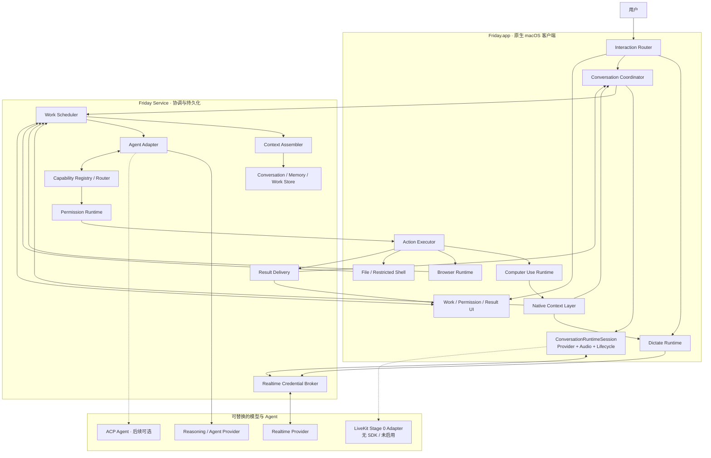
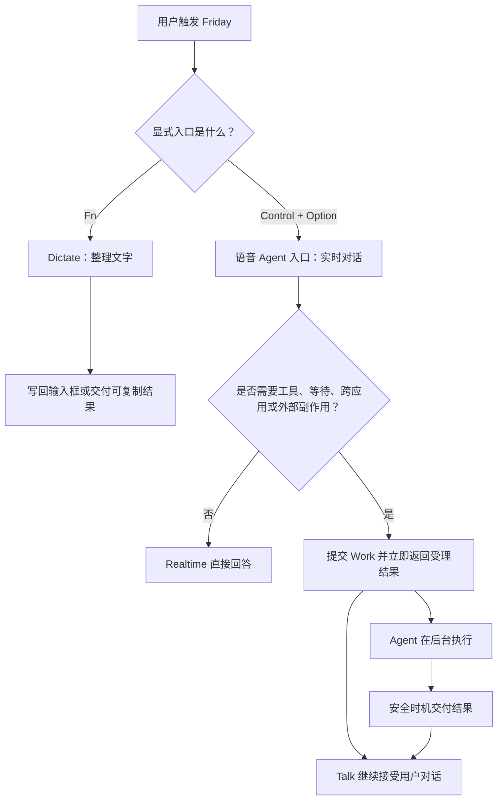
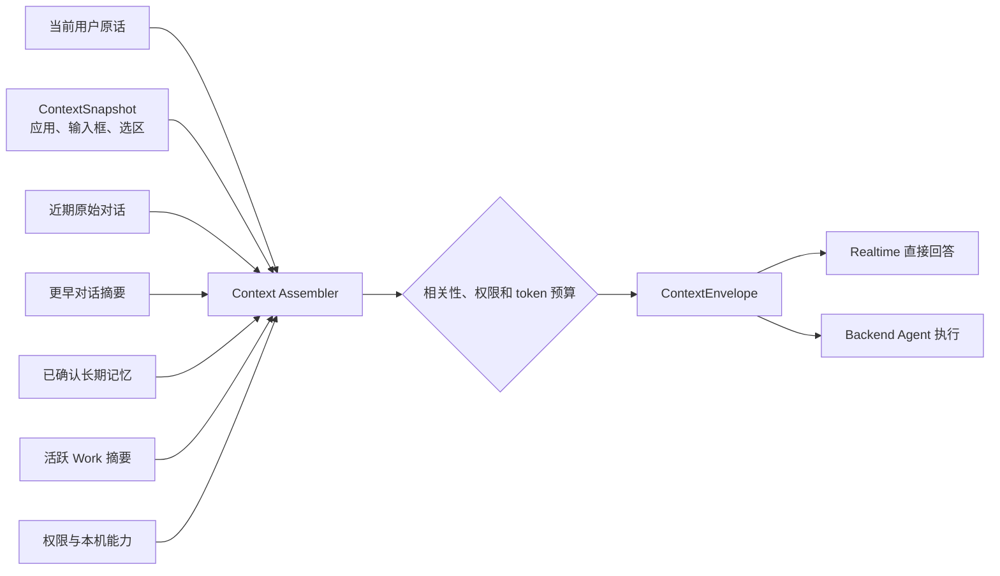
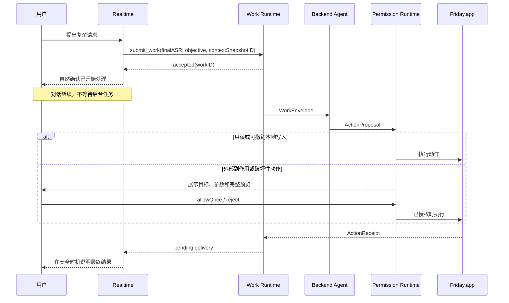

# Friday 架构设计说明（概览）

> 版本：1.0
>
> 日期：2026-08-05
> 状态：目标架构。本文用于快速理解系统；已经实现和尚未实现的边界见第 11 节。

## 1. 一句话说明

Olli（工程兼容名 Friday）是一个原生 macOS 通用 Agent：用户通过语音或文字表达目标，系统观察当前电脑状态，规划并选择合适能力，跨应用执行并验证结果；低延迟听写和对话是入口，不是 Agent 本体。

用户只面对一个 Olli，但系统内部不是“一个模型包办一切”，而是四部分协作：

```text
原生 macOS 层
负责看见输入框、选中文字和屏幕选区，并安全执行本地动作

Conversation Runtime
负责听写、实时对话、插话和直接回答

Work / Agent Runtime
负责可持续、可修改、可取消、受权限控制的后台任务

Capability Router / Computer Use Runtime
负责为文件、浏览器和桌面任务选择最可靠的执行器，并在动作后重新观察验证
```

“插话”属于 Conversation Runtime。当前 Direct Realtime 路径使用 Provider `semantic_vad` 判断用户 Turn，但关闭 Provider 自动取消（`interrupt_response=false`）。VoiceProcessingIO 播放期只上传 AEC 后通过本地持续人声候选门的音频；Provider 确认 `speech_started` 后，客户端才停止并截断当前回复。没有可靠回声参考的半双工降级路径仍暂停麦克风上行。自动测试只证明状态与契约，真实房间的插话体验仍待真机验收。

## 2. 为什么不能只使用一个 Realtime 模型

Realtime 模型适合快速听和说，但复杂 Agent 任务还需要：

- 在语音连接断开后继续运行；
- 查询进度、取消和失败恢复；
- 调用浏览器、文件或第三方服务；
- 在发送、删除和提交前等待用户确认；
- 确认结果真的写入、播放或展示给用户。

如果把这些职责都塞进一次 Realtime 会话，语音断开就可能丢任务，模型说“完成了”也无法证明电脑真的完成了动作。

因此 Friday 遵循一个核心原则：

> 对话始终可用；复杂任务异步执行；动作必须由系统证据确认。

## 3. 整体架构



界面如何承载这些 Runtime，而不把内部复杂度暴露给用户，见[《交互架构》](交互架构.md)。灵动岛优先负责当下语音；后台 Work、历史与 Memory 只有形成真实 Store 后才增加信息入口，不预先搭建空壳主窗口。

开发阶段 Service 运行在本机；正式产品可以把凭证、计费和部分 Work 迁到云端。无论部署在哪里，macOS 输入框句柄和本地动作都只能留在 Mac 客户端。

## 4. 两个入口、快速路径与共享 Agent 核心



### 4.1 Dictate：最快的写回路径

```text
Fn
-> 录音
-> 清理口癖并整理结构
-> 写入锁定的输入框
```

Dictate 不创建后台 Work，也不依赖长期 Agent Session。它必须低延迟、忠于原意、可撤销；没有输入框时仍然交付可复制结果。

### 4.2 Talk：持续的自然对话

```text
Control + Option
-> 建立 Realtime 会话
-> 直接回答简单问题
-> 必要时提交后台 Work
-> 对话继续，不等待 Work
```

用户插话只中断当前语音回复，不会误取消已经提交的后台任务。

### 4.3 Work 与 Agent：可追踪的后台执行

```text
用户请求 + 当时的上下文快照
-> 创建 Work
-> Agent 观察、规划并选择能力
-> 需要时请求权限
-> 执行动作
-> 重新观察并验证
-> 交付结果
```

Work 适合需要工具、等待、跨应用、多步骤或有外部副作用的请求。Agent 是 Work 内部的 `Observe -> Plan -> Act -> Verify` 循环，不是 Realtime 调用一次本地工具的别名，也不应该拖慢普通听写和简单问答。

### 4.4 模型职责

Friday 当前保留两条明确的 `gpt-realtime-2.1` 产品路径：

- `Dictate` 使用音频输入和文字输出，负责忠于原意地清理口癖、整理结构并生成可写回文字；
- `Talk` 使用音频输入和音频输出，负责低延迟自然对话。

对话历史所需的“用户原话”不是第三种用户模式，而是一条独立、可选的 `UserTurnTranscriptionProvider`。它不能用 Realtime 整理后的 objective、助手复述或 Dictate 结果冒充。内部 Alpha 尚未启用这条额外通道时，Talk 继续可用，但缺少可靠原话的 Turn 不进入长期记忆。

### 4.5 Talk Runtime 可替换边界

`ConversationCoordinator` 不再分别决定“启动哪个 Provider”和“启动哪套音频”。它只依赖一个 `ConversationRuntimeSession`：

```text
ConversationCoordinator
        -> ConversationRuntimeSession
              |- ConversationProviding
              |- ConversationAudioServicing
              |- audioOwner / recordingPolicy
              `- atomic start / stop
```

当前 App 只装配 `DirectRealtimeConversationRuntimeSession`，仍由 Friday 的 VoiceProcessingIO 拥有设备音频，再连接现有 Realtime Provider。LiveKit 仅完成 Stage 0 假 Transport 契约，用于证明未来可以由单一候选 Runtime 同时拥有 Room、麦克风、播放和 AEC；它没有进入产品路径，也没有引入 SDK 或真实网络连接。

## 5. 七个核心概念

| 概念 | 通俗理解 | 主要职责 |
| --- | --- | --- |
| `Conversation` | 正在进行的一通电话 | 当前语音、轮次、插话和直接回复 |
| `Conversation History` | 过去的聊天记录 | 跨会话恢复“昨天聊到哪里” |
| `ContextSnapshot` | 按下快门时桌面上有什么 | 冻结当前应用、输入目标、选中文字和图片附件 |
| `Memory` | 经用户允许保存的小笔记 | 保存稳定偏好、身份、目标和约定 |
| `Work` | 后台工单 | 保存任务目标、状态、进度、结果和错误 |
| `ActionProposal` | Agent 提交的操作申请 | 描述目标、参数、预览、风险和可撤销性 |
| `Delivery` | 结果签收单 | 记录结果是否真正展示、播报或写入 |

这些对象必须拥有独立 ID。Friday 不能只凭“这是最近一次返回”来判断结果属于哪个请求。

## 6. 上下文、历史和记忆

这三个概念最容易被混淆：

```text
上下文 = 完成当前请求需要的材料
历史   = 之前实际聊过什么
记忆   = 值得跨会话长期保留的稳定信息
```



### 6.1 当前会话

同一次 Talk 中保留近期原始轮次，使代词、追问和插话能够自然衔接。它的生命周期与当前 Realtime 连接不同：连接重建时，可以从本地会话记录恢复必要内容。

### 6.2 跨会话历史

为了支持“继续昨天的话题”，Friday 保存必要的文字轮次，不保存原始音频。对话变长后采用：

```text
最近若干轮原文
+ 更早内容的滚动摘要
+ 尚未结束的决定、问题和 Work 引用
```

摘要不能替代原始事实。重要结论需要保留来源轮次 ID，发生冲突时优先读取较新的用户原话。

### 6.3 长期记忆

长期记忆只保存稳定且以后有用的信息，例如语言偏好、工作习惯、长期目标和明确约定。

- 用户明确说“记住”时可以直接保存，并给出反馈。
- Friday 推断出的偏好只能进入 `proposed`，不能静默成为永久记忆。
- 用户可以查看、修改、确认和删除全部记忆。
- 当前用户说法始终优先于旧记忆。
- 密码、验证码、API Key、Token 和其他凭证禁止进入记忆。

### 6.4 Context Assembler

模型每次只获得完成当前请求所需的最小上下文：

```text
当前用户原话
-> 本次 ContextSnapshot
-> 最近相关对话
-> 相关长期记忆
-> 活跃 Work 摘要
-> 当前权限和能力
```

每一类都有条数、字符数或 token 预算。早期使用作用域、标签和关键词检索；只有在记忆量增长且检索质量有证据不足时，才增加向量检索。

### 6.5 与 Qwen 的对应关系

Friday 参考的是 Qwen 的分层原则和数据流，不是复制它的文件格式：

| Qwen Audio Agent | Friday 对应设计 | Friday 的扩展 |
| --- | --- | --- |
| `ConversationSync` 内存近期消息 | Session Context | 增加跨重启 Conversation Store 和滚动摘要 |
| `USER.md` profile | profile Memory | 使用统一 MemoryRecord、来源和确认状态 |
| `frontend-memory.json` long_term | confirmed Memory | 增加 `proposed`、冲突替换、加密和用户管理 |
| `frontend-agent-context` | Context Assembler | 增加 ContextSnapshot、预算、provenance 和 revision |
| Task Store | Work Runtime | 加入原生 macOS ActionProposal、ActionReceipt 和风险分级 |
| Announcement Manager | Result Delivery | 分开记录语音、文字和本地动作交付 |

Qwen 当前没有完整跨重启对话历史、滚动摘要、向量记忆或 Friday 的 macOS 输入框和区域截图层。因此 Friday 的记忆设计是“以 Qwen 为基线，再补齐桌面产品需要的连续性、隐私和动作证据”。

## 7. Work、动作和权限

Work 是产品工单，不是模型的隐藏思考过程。用户应该能看到有限但真实的状态：

```text
queued -> running -> awaitingPermission -> running -> completed
   |          |                |              |
   +----------+----------------+--------------+-> cancelling -> cancelled
                         \---------------------> failed
```

Agent 不能直接操作 AppKit、Accessibility 或鼠标。它只能产生结构化 `ActionProposal`，由 Mac 客户端检查目标和权限后执行。

当前两条真实动作是低风险应用打开/切换与可撤销文字写入。它们不需要先创建后台 Work：Realtime 只解释“打开哪个应用”或“写什么、写到哪个应用”，Friday.app 才解析本机已安装 Bundle、启动或激活进程、复验输入框并执行。复杂多步骤请求仍进入独立 Work Runtime。

```text
用户：“把 1、2、3、4 写入 Codex”
-> Realtime: write_focused_input(text, application="Codex")
-> ConversationActionBridge: ActionProposal
-> RunningApplicationResolver: 查找已安装 Bundle，启动或激活 com.openai.codex
-> FocusedInputActionExecutor: 复验焦点并粘贴一次
-> ActionReceipt: succeeded | failed | unknown
-> Realtime: 只根据回执说结果
```

| 风险 | 示例 | 默认策略 |
| --- | --- | --- |
| 只读 | 读取用户主动框选的区域 | 本次触发即授权 |
| 本地导航 | 打开或切换到应用 | 可以自动执行，但必须复验应用身份和前台状态 |
| 可撤销本地写入 | 写入当前输入框 | 可以自动执行，但必须可撤销 |
| 外部副作用 | 发消息、发邮件、提交表单 | 展示完整预览并逐次确认 |
| 破坏性动作 | 删除、购买、修改系统权限 | 逐次确认，必要时二次确认 |

取消不是隐藏 UI。Friday 必须等待执行端确认停止，再把 Work 标记为 `cancelled`。



## 8. 结果交付

以下三个时间点不同：

```text
模型生成了结果
电脑执行了动作
用户收到了结果
```

因此后台结果需要独立 Delivery 状态。用户正在说话时不插播；语音被打断后可以稍后继续；写入动作需要本地执行回执；多个客户端存在时，同一结果只能交付一次。

## 9. 数据和隐私

目标存储策略：

| 数据 | 是否持久化 | 说明 |
| --- | --- | --- |
| 原始音频 | 否 | 只在当前处理链路的内存中存在 |
| 完整截图 | 默认否 | 使用短期附件，过期或任务结束后删除 |
| 对话文字 | 是，可清除 | 用于跨会话连续性，敏感内容加密 |
| 长期记忆 | 是，可编辑 | 只有明确记忆或用户确认的内容 |
| Work 与 Delivery | 是，有限保留 | 用于进度、恢复、取消和结果交付 |
| AXUIElement 句柄 | 否 | 只能存在于 Friday.app 内存 |
| API Key 和短期凭证 | Keychain / 内存 | 不进入源码、普通日志或用户内容存储 |

第一版使用本地 SQLite 保存结构化状态，敏感文本字段使用 Keychain 管理的密钥加密。默认保留期限和用户设置仍需在公开 Beta 前确认；在此之前不能把无限保存作为产品默认。

## 10. 查漏补缺后的关键设计

重新对照 Qwen 的架构说明和 Friday 当前代码后，补齐了以下容易遗漏的环节：

| 环节 | 如果缺失会怎样 | Friday 的设计 |
| --- | --- | --- |
| 可靠的最终用户转写 | 无法保存真实用户原话，只能保存模型猜测 | Dictate 继续使用 `gpt-realtime-2.1`；Talk 历史另设 `UserTurnTranscriptionProvider`，最终 ASR 是事实来源 |
| 对话 Thread 选择 | 每次启动都不知道该继续哪段对话 | Talk 默认进入稳定主 Thread，用户可明确新建或切换 Thread |
| Realtime 重连恢复 | 网络重连后上下文突然清空或重复注入 | 使用带 revision 的 `ConversationBootstrap`，只恢复一次必要上下文 |
| 固定协调 Agent Session | 每个 Work 都像第一次见用户 | 每个 owner 与 backend 复用一个稳定协调 Session，并串行写入 |
| 进程所有权 | 退出 App 后任务无声消失 | 有活跃 Work 时退出必须选择继续后台运行或停止任务 |
| 进度可观察性 | 用户只看见“思考中”，也可能泄露 reasoning | 只展示脱敏、有限、可理解的公开 activity |
| 重启恢复规则 | UI 假装任务仍在执行 | 只有能用持久化 ID 重新关联的 Work 才恢复，其余明确失败 |
| 多通道交付 | 模型完成被误认为用户已经收到 | 语音、文字和本地动作分别记录 Delivery 回执 |
| 派生数据版本 | Prompt 或模型升级后旧摘要无法解释 | 摘要和记忆候选记录 schema、生成版本和来源 Turn |
| 离线与网络中断 | 请求无限排队或重复提交 | 未受理请求明确失败；已受理 Work 依 submissionKey 去重并按证据恢复 |

这些设计是目标架构，不代表当前代码已经实现。

## 11. 当前状态和目标差距

### 已实现

- 原生菜单栏、快捷键和灵动岛交互；
- Accessibility 输入框定位和可撤销写回；
- Realtime Dictate 与 Direct Realtime Talk；Talk 默认由 Provider `semantic_vad` 独占用户端点和自动回复，本地音量门只负责声波/脱敏诊断；
- VoiceProcessingIO 提供系统 AEC；Assistant 准备/播放期只放行本地确认的人声候选，由 Provider VAD 确认后停止并截断播放；半双工降级不支持播放期插话；
- 用户主动区域框选和短期图片上下文；
- Provider 与 Mock 边界；
- Talk Session 身份、token 和费用账本；
- Provider 临时 ID 到 Friday 自有 Turn、Response、Assistant Item 和 Playback ID 的关联器，能够拒绝上一轮迟到音频；
- `ConversationRuntimeSession` 已把 Talk 的 Provider、音频端口、所有权和原子启停从 Coordinator 装配中独立；当前产品仍使用 Direct Realtime 包装器；
- LiveKit Stage 0 已定义短期 Room 凭证、强制关闭录制、单一音频所有权和 Provider 事件映射的假 Transport 契约；没有 LiveKit SDK 或真实 Room；
- `ActionProposal`、`ActionReceipt` 与 64KB 上限的版本化 RPC 数据契约已存在；应用导航和可撤销输入框写入具备本地执行器，尚无高风险权限决策或远端执行能力。
- `ConversationActionBridge`、已安装/运行应用解析器和输入框动作执行器已接通 `open_application` 与 `write_focused_input`；指定应用可以先启动或激活，显式应用名优先于 Talk 启动时锁定目标，Codex 通过 Bundle ID 映射到实际应用。
- 两个本地工具都按 Tool Call ID 幂等，只在本地回执为 `succeeded` 时允许模型明确声称完成；写入路径不发送、提交或发布内容。
- `ComputerUseRuntime` 已提供能力目录、逐步观察、动作回执和独立验证契约；主工作台 Agent 页面通过受限原生 TextEdit 适配器完成固定的新建、写入、保存和 UTF-8 读回任务。它尚未接入真实 Planner，也不是通用桌面执行器。

### 尚未实现

- 跨会话 Conversation Store 和滚动摘要；
- 可替换的最终用户转写 Provider 和稳定 Conversation Thread；
- 可管理、可确认的长期 Memory Store；
- 统一 Context Assembler；
- 带 revision 的 ConversationBootstrap 和重连去重；
- Work Scheduler、持久化 Store、跨重启取消和恢复；
- Agent Adapter 与稳定协调 Session；
- 通用 Capability Registry / Router；
- 通用 Computer Use Runtime，以及应用、窗口、AX 与截图的联合观察；当前只有受限 TextEdit 原生适配器和固定任务入口；
- 点击、滚动、快捷键、文件、受限 Shell、浏览器 DOM/CDP 等领域执行器；
- 单一真实 Planner 驱动的 `Observe -> Plan -> Act -> Verify` 循环；
- 高风险 Action Permission Runtime 和远端 Action Transport；
- Delivery Ledger 和 Agent 任务界面；
- LiveKit Swift SDK、真实 Room/Agent、真实 AEC/Adaptive Interruption 和 `gpt-realtime-2.1` 兼容性验证。

文档中的“目标架构”不能描述成当前产品能力。

## 12. 实施顺序

```text
1. 收口当前混合基线，保留 Dictate、Talk、框选和已有本地 Action 的已验证行为。
2. 扩展现有固定 TextEdit 任务入口为文字任务台，并验证 Computer Use Runtime：应用/窗口观察、AX 与截图、点击、输入、滚动和快捷键。
3. 接入单一 Planner，打通一个真实 `Observe -> Plan -> Act -> Verify` 垂直任务，并以读回证据判定完成。
4. 扩展文件/受限 Shell、浏览器 DOM/CDP 和跨应用任务，继续使用同一 Capability Router 与 ActionReceipt。
5. 把 Conversation 接入异步 Work，使用户能查询、修改、暂停和取消，语音断开不影响任务。
6. 完成外部副作用确认、持久化、上下文和记忆，再进入公开 Beta。
```

每一步都要保持 Dictate 和 Talk 可用，不能为了架构迁移一次性重写产品。

LiveKit Stage 1 不在上述主线中自动推进；只有单独批准预算，并通过真实中文端点、插话、延迟、AEC、费用和隐私对比后，才决定是否替换 Direct Realtime Talk。

## 13. 关键设计取舍

| 选择 | 原因 |
| --- | --- |
| Dictate 不经过 Agent | 保持低延迟、低成本和高确定性 |
| Talk 和 Work 生命周期分离 | 后台任务不会阻塞或随语音断开而消失 |
| 历史与记忆分开 | 聊过不代表值得永久记住 |
| ContextSnapshot 不可变 | 防止后台任务执行时误用已经变化的输入框或屏幕 |
| Agent 只提出动作 | 系统权限、目标校验和执行回执由本地可信层负责 |
| 先 SQLite，暂不引入向量库 | 当前数据规模小，结构化查询、事务和可解释性更重要 |
| 先单一 Backend | 先验证产品闭环，再承担多供应商适配成本 |
| 参考 Qwen 但不复刻 | 借鉴其 Work 和交付边界，保留 Friday 更强的原生 macOS 能力 |
| Runtime 而非 Provider 作为 Talk 替换单位 | 音频设备、AEC、播放回执和网络连接必须由同一套会话原子启停，避免双重音频引擎 |

## 14. 文档关系

- 本文：面向产品讨论、架构评审和面试说明的总体视图。
- [通用 Agent 产品与实施路线](通用Agent路线.md)：当前北极星、实施 Milestone 和开发级验收故事。
- [技术架构](技术架构.md)：数据模型、状态机、模块边界和迁移细节。
- [产品路线图](产品路线图.md)：阶段、用户故事和验收条件。
- [Qwen Audio Agent 架构研究](Qwen%20Audio%20Agent%20架构研究.md)：参考项目的源码证据和借鉴边界。
