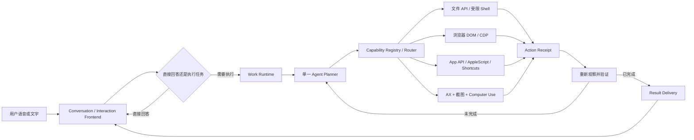

# Olli 通用 Agent 产品与实施路线

> 版本：1.0 · 日期：2026-08-06 · 状态：当前产品与工程主线

## 1. 北极星

Olli 是一个原生 macOS 通用 Agent。用户用自然语言描述希望得到的结果，Olli 负责理解当前电脑状态、规划步骤、选择工具、跨应用执行、验证结果，并在执行期间继续接受用户的追问、修改、暂停和取消。

```text
自然语言目标
-> 理解当前环境
-> 判断直接回答还是创建 Work
-> 规划并选择能力
-> 执行动作
-> 重新观察和验证
-> 未完成则调整计划
-> 向用户交付有证据的结果
```

典型目标包括：

- 新建文件、写入内容、重命名和移动文件；
- 打开浏览器、搜索信息、填写网页和下载文件；
- 打开或切换任意普通 macOS 应用，点击、输入、滚动和使用快捷键；
- 在多个应用之间读取、整理和搬运信息；
- 创建邮件或消息草稿，并在用户确认后发送；
- 执行代码、项目和 CLI 工作，同时限制命令范围和数据访问。

“任何软件”是覆盖目标，不是 100% 成功承诺。密码框、验证码、受保护内容、远程桌面、游戏/Metal/Canvas、自绘且拒绝辅助功能与合成事件的界面必须返回真实限制，不能伪造成功。

## 2. 路线回正结论

之前的工作并非全部错误，但存在两项产品顺序偏差：

1. 把 Dictate、Talk、屏幕理解和 Agent 当成必须逐层完成的四个产品阶段，导致大量时间用于优化单点入口，却没有尽早验证通用执行闭环。
2. 把 Realtime 的 `open_application` 和 `write_focused_input` 工具调用描述成 Agent 能力，实际上它们只是两个低风险本地 Action，没有规划、通用观察、多步骤执行和结果验证循环。

以下能力保留：

- Dictate 的低延迟整理和写回；
- Talk 的实时对话、插话、图片上下文和自然反馈；
- Conversation、Work、ActionProposal、ActionReceipt、权限分级和异步交付边界；
- Accessibility、应用解析、屏幕捕获、音频与 Provider 隔离；
- Qwen 式“对话不阻塞，后台 Agent 异步执行”的调度方向。

以下做法停止：

- 不再为微信、Codex 等单个应用持续增加名称、焦点或输入框特例；
- 不再把“模型调用了一个工具”称为完整 Agent；
- 不等 Dictate 和 Talk 的所有体验问题全部结束后才建设 Agent；
- 不把几十个桌面工具直接堆进 Realtime Prompt；
- 不让终端、视觉坐标或单一 Accessibility 路径承担所有任务；
- 不以模型口头声称、API 返回 200 或事件成功发送代替动作结果验证。

## 3. 产品形态

Dictate、Talk 和 Agent 不再是三个前后串行的产品，而是两个入口、两条快速路径和一个共享执行核心：

```text
Fn
-> Dictate 快速路径
-> 整理并写回，不创建重型 Work

Control + Option
-> Conversation 前台
-> 普通问答直接回复
-> 需要工具、等待、多步骤或外部副作用时提交 Work

文字任务入口
-> 直接提交 Work

所有 Work
-> 共享 Agent Planner + Capability Router + Computer Use Runtime
```

对话和执行必须相互独立：

- Work 执行时 Conversation 始终可以继续；
- 用户可以查询进度、追加条件、暂停或取消；
- 打断语音回复不等于取消 Work；
- Work 完成不等于结果已经播报或展示；
- 任务变化必须通过同一个 Work 身份和版本记录，不能悄悄启动第二个重复任务。

## 4. 目标架构



### 4.1 Conversation Frontend

- Realtime 负责低延迟听说、直接问答和提交 Work；
- 不持有后台规划器、完整工具目录或桌面执行循环；
- 对用户只表达任务状态和可理解的公开进度，不朗读内部 reasoning；
- 网络或语音断开不自动取消已受理 Work。

### 4.2 Work Runtime

- 每个任务拥有稳定 WorkID、目标、版本、状态和取消信号；
- 支持 queued、running、awaitingPermission、paused、completed、failed、cancelled；
- 提交、重试和恢复必须幂等；
- 第一条真实垂直链可以使用内存 Store，但进入跨重启任务前必须迁移到持久化 Store。

### 4.3 Agent Planner

- 第一版只接一个规划 Backend，不同时维护多个模型矩阵；
- Planner 只看到经过预算选择的上下文、能力描述和结构化回执；
- Planner 不能直接访问 AppKit、AXUIElement、长期密钥或无限制终端；
- 每一步都根据最新观察决定下一步，不一次性生成不可校验的长脚本。

### 4.4 Capability Router

工具按任务领域选择，不使用一个固定工具解决所有问题：

| 领域 | 首选路径 | 兜底路径 |
| --- | --- | --- |
| 文件与代码 | 文件 API、项目工具、受限 Shell | 前台应用操作 |
| 浏览器 | DOM、CDP、Playwright 类能力 | AX，最后使用视觉点击 |
| 支持自动化的 App | 官方 API、URL Scheme、AppleScript、Shortcuts | AX 或视觉 Computer Use |
| 普通桌面 App | AX 语义元素和后台动作 | 窗口截图、像素操作、必要时置前 |
| 自绘/Canvas | 视觉定位和前台鼠标键盘 | 明确报告限制 |

Shell 是文件、代码和 CLI 任务的正式能力，不是 GUI 自动化的万能替代。Shell 必须拥有工作目录、命令类别、超时、输出大小和敏感路径边界。

### 4.5 Computer Use Runtime

第一候选是以嵌入式 daemon 方式验证 Cua Driver；这是待验证方案，不是已经成立的依赖或权限结论：

- 由 Olli.app 管理启动和退出，真机确认 TCC 将 Accessibility 与 Screen Recording 归属哪个签名进程；如果 helper 需要独立授权，必须先评估用户体验和签名方案，不能声称权限自然继承；
- 通过私有 Socket/MCP 暴露应用、窗口、AX、截图、点击、输入、滚动、快捷键和浏览器能力；
- 保留 Friday 自有 `ActionProposal/ActionReceipt`，第三方结果先转换为产品协议；
- 不把 Cua Driver 类型、进程或权限模式暴露到 SwiftUI 和 Realtime Prompt；
- 先做签名、最低系统版本、崩溃恢复、包体和真实 Electron/微信行为的可行性验证，再决定正式依赖还是按其契约自研 Swift 执行层。

动作升级遵循证据，不凭模型猜测：

```text
AX 语义动作并读回验证
-> 浏览器 DOM/CDP 精确动作
-> 窗口内像素动作
-> 必要时显式置前并使用 HID
-> 重新读取 AX/DOM/截图确认
```

### 4.6 Permission 与 Delivery

| 风险 | 示例 | 默认策略 |
| --- | --- | --- |
| 只读 | 读取窗口、文件元数据、用户主动选择的屏幕 | 自动执行并记录来源 |
| 本地导航 | 打开应用、打开网页、切换窗口 | 自动执行并验证目标 |
| 可撤销本地修改 | 新建文件、写输入框、保存草稿 | 自动执行，保留撤销或恢复证据 |
| 外部副作用 | 发邮件、发消息、提交表单、发布 | 展示目标与完整预览，逐次确认 |
| 破坏性/敏感 | 删除、购买、支付、权限变化 | 强制确认，必要时二次确认 |

模型生成、动作执行和结果交付是三个状态。外部副作用的 `unknown` 回执不得自动重试，防止重复发送或提交。

## 5. 实施路线

路线按可演示、可验证的垂直任务推进，不再先横向搭完所有底层系统。

### Milestone 0：基线收口

目标：得到可以可靠继续开发的单一基线。

- 收口当前混合分支和已有未提交改动；
- 保留 Dictate、Talk、框选和现有本地 Action 的已验证行为；
- 明确现有真机未通过项，不在新 Agent Issue 中伪装已解决；
- 新建独立 Computer Use Issue、分支和 PR，不继续扩大 focused-input Issue。

退出条件：工作区无索引冲突，主 Scheme 可以构建，当前行为与未验收项都有记录。

### Milestone 1：Computer Use 可行性验证

目标：证明 Olli 可以通过统一执行器观察并操作普通 macOS 应用。

- 嵌入 Cua Driver 候选运行时；
- 检查权限继承、生命周期、签名和本地私有连接；
- 实现 `listApps`、`listWindows`、`observeWindow`、`click`、`typeText`、`hotkey` 的 Provider-neutral Adapter；
- 将第三方 effect/escalation 转换为 Friday ActionReceipt；
- 不连接语音，不接高风险动作，先用本地文本测试台验证。

首个退出任务：

> 用户输入“打开 TextEdit，新建文档，写入 Friday agent smoke test，并保存到指定测试目录”，系统完成任务并通过文件内容或窗口状态读回验证。

### Milestone 2：最小多步骤 Agent

目标：让一个真实 Planner 使用统一工具完成任务，而不是运行固定脚本。

- 接入单一 Agent Backend；
- 建立 Observe -> Plan -> Act -> Verify 循环；
- Work 支持进度、暂停、取消、失败和幂等；
- 加入文件 API 与受限 Shell；
- 保留文本测试入口，语音只作为第二入口接入。

退出条件：同一 Planner 可以完成至少三个不同参数的文件/桌面任务，失败时不会盲目继续或声称成功。

### Milestone 3：浏览器与跨应用

目标：完成真正有用户价值的多应用信息流。

- 浏览器 DOM/CDP 观察与动作；
- 打开页面、搜索、填写但不提交、下载文件；
- 在浏览器、文件系统和一个普通桌面 App 之间搬运信息；
- 使用同一个 Work 和 ActionReceipt 链验证每一步。

退出任务示例：

> 搜索一个公开主题，把来源摘要写入新文件，并在浏览器和文件内容中验证结果。

### Milestone 4：Conversation 与异步 Work 融合

目标：用户自然说话时，任务执行不阻断对话。

- Realtime 只提交和观察 Work；
- 用户可以问进度、追加条件、暂停和取消；
- 任务完成只在用户空闲时交付；
- 灵动岛展示简洁状态，任务详情进入主工作台；
- 打断语音回复不取消 Work。

退出条件：执行一个不少于三步的真实任务期间，用户可以完成一次进度询问和一次条件修改，最终只产生一个任务结果。

### Milestone 5：邮件、消息和外部副作用

目标：在安全边界内完成真实发送类任务。

- 先实现草稿，再实现发送；
- 收件人、目标应用、主题和正文进入结构化预览；
- 确认绑定 WorkID、ActionID 和内容 revision；
- 发送后通过目标应用或 Provider 回执确认；
- `unknown` 时停止，不自动重发。

退出任务示例：

> 根据指定文件生成邮件草稿；用户确认后只发送一次，并能查看发送结果。

### Milestone 6：持久化、上下文和记忆

目标：让跨会话和跨重启体验可靠，而不是只在单次演示中工作。

- 持久化 Work、Delivery、Conversation Thread 和近期上下文；
- 重启后恢复可证明的任务，无法恢复的任务明确失败；
- 引入 Context Assembler 和预算；
- 长期 Memory 与对话历史、任务历史分开；
- 用户可以查看、纠正和删除记忆。

记忆不再是首个 Agent 闭环的前置条件，但在公开 Beta 前必须完成。

### Milestone 7：公开 Beta

- 安装、签名、公证、DMG 和升级；
- 权限引导、隐私说明、数据删除和故障恢复；
- 成本、限流、异常循环保护和可观察性；
- 真实任务评测集覆盖文件、浏览器、原生 App、跨应用和外部副作用。

## 6. 开发级用户故事

### User Story AG-001：用自然语言完成文件任务

- **Summary：** 让知识工作者不用学习终端也能创建并填写文件。

#### Use Case:

- **As a：** 需要快速整理信息的 Mac 知识工作者
- **I want to：** 用自然语言要求 Olli 新建文件并写入指定内容
- **so that：** 我可以直接获得可继续使用的文件，而不必手动打开应用和保存

#### Acceptance Criteria:

- **Scenario：** 创建并验证一个新文件
- **Given：** Olli 已获必要权限，指定测试目录可写且不存在同名文件
- **When：** 用户要求在该目录新建指定名称的文件并写入固定内容
- **Then：** 文件实际存在、内容与请求一致，并且 Olli 只在读回验证成功后报告完成

### User Story AG-002：完成浏览器到文件的跨应用任务

- **Summary：** 让知识工作者把公开网页信息整理成可交付文件。

#### Use Case:

- **As a：** 经常在浏览器和文档之间搬运信息的研究者
- **I want to：** 让 Olli 搜索公开资料并整理到一个文件中
- **so that：** 我可以把时间用在判断信息，而不是机械切换和复制粘贴

#### Acceptance Criteria:

- **Scenario：** 把公开搜索结果写入新文件
- **Given：** 浏览器和测试目录可用，任务不需要登录或提交外部表单
- **When：** 用户要求搜索指定主题并把来源和摘要写入文件
- **Then：** Olli 创建包含可核对来源的文件，并通过浏览器状态和文件读回证明任务完成

### User Story AG-003：执行期间继续控制任务

- **Summary：** 让用户在长任务执行时仍能自然询问和调整。

#### Use Case:

- **As a：** 同时处理多项工作的 Mac 用户
- **I want to：** 在 Agent 执行期间询问进度或修改目标
- **so that：** 我不需要等待任务结束后再发现方向错误

#### Acceptance Criteria:

- **Scenario：** 执行中修改尚未完成的任务
- **Given：** 一个多步骤 Work 正在运行且当前动作没有外部副作用
- **When：** 用户要求修改该 Work 的剩余目标
- **Then：** Olli 保留已验证结果、更新同一个 Work 的目标版本，并只按新目标继续后续步骤

### User Story AG-004：确认后发送邮件

- **Summary：** 让用户把自然语言需求安全地变成一次真实邮件发送。

#### Use Case:

- **As a：** 需要快速处理邮件的知识工作者
- **I want to：** 让 Olli 准备邮件并在我确认后发送
- **so that：** 我可以减少重复操作，同时避免误发给错误对象

#### Acceptance Criteria:

- **Scenario：** 预览确认后只发送一次
- **Given：** Olli 已生成包含收件人、主题和正文的邮件草稿
- **and Given：** 当前内容 revision 尚未获得发送授权
- **When：** 用户确认发送该 revision
- **Then：** Olli 只执行一次发送动作，并以目标邮件系统的可验证回执报告结果

## 7. 当前状态

已实现但尚未构成通用 Agent：

- Dictate 与 Realtime Talk；
- 区域截图上下文；
- Conversation 与 Work 的基础契约；
- Mock Work Runtime；
- `open_application` 和 `write_focused_input` 两个本地 Action；
- ActionProposal、ActionReceipt、风险和幂等基础；
- Computer Use 最小中立契约、能力目录、动作后重观察和固定 TextEdit 任务入口；原生适配器只覆盖本地烟囱任务，尚未接入真实 Planner。

当前关键缺口：

- 通用 Computer Use Runtime（当前只有受限 TextEdit 原生适配器，尚未覆盖窗口/AX/截图联合观察）；
- 应用/窗口/AX/截图联合观察；
- 点击、滚动、快捷键、文件、Shell 和浏览器工具；
- 单一真实 Planner 与多步骤验证循环；
- 持久化 Work 和可恢复 Delivery；
- 外部副作用 Permission Runtime；
- 跨会话上下文和长期 Memory。

因此当前产品状态应描述为：

> 语音入口和部分本地 Action 已实现，通用 Agent 执行核心尚未实现。

## 8. 后续开发规则

1. 每个 Agent PR 必须对应一个可独立验收的垂直任务，不按“增加十个工具”作为完成定义。
2. 新工具必须注册 Capability、声明风险、返回 ActionReceipt，并有动作后验证策略。
3. 第三方执行器通过 Adapter 隔离；不得让其协议进入 UI、Realtime Prompt 或产品存储。
4. 先用文本测试台验证 Planner 和 Computer Use，再接语音，避免音频问题掩盖执行问题。
5. 自动测试覆盖契约、路由、状态和幂等；真实 macOS 交互使用固定任务矩阵人工验收。
6. 任何“已完成”都必须指出验证证据；无法验证时返回 `unknown` 或失败。
7. 外部副作用保持确认边界；可撤销本地动作默认自动执行。
8. 新方向与本文冲突时，先更新本文和决策记录，再修改代码。

## 9. 参考与决策边界

- Qwen Audio Agent：借鉴 Realtime 前台与后台 ACP Agent 的非阻塞调度，不把它视为桌面执行器。
- Cua Driver：源码级确认其动作回执、嵌入式 daemon 与升级阶梯有参考价值；由于它不是 Swift Package，正式接入仍待 arm64 构建产物、嵌套签名、公证、macOS 14 和签名真机 TCC 验证，不作为当前 Computer Use PR 的运行依赖。
- Agent Notch：参考 Swift 上下文选择、工具路由和视觉执行循环，不直接采用其模型、密钥或单体状态设计。
- Agent-S：参考截图 grounding、规划/执行拆分和评测方法，不采用 Python/pyautogui 作为 Olli 的原生生产执行层。

本文定义产品与实施主线；详细契约见[《技术架构》](技术架构.md)，已实现事实见[《产品路线图》](产品路线图.md)，交互职责见[《交互架构》](交互架构.md)。
